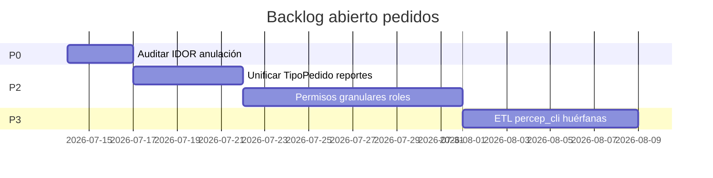

# Backlog de implementación — Pedidos (post ingeniería inversa)

**Alcance:** ítems derivados del AS-IS PHP y gaps vs TO-BE Synap.  
**Escala esfuerzo:** S (<1d), M (1-3d), L (1-2 sem), XL (>2 sem)  
**Prioridad:** P0 crítico → P3 nice-to-have

---

## P0 — Crítico operativo / datos

| ID | Ítem | Esfuerzo | Origen | Estado Synap |
|----|------|----------|--------|--------------|
| BL-P0-01 | Validación stock SQL en checkout (paridad negocio, mejora PHP) | M | PED-RN-021 | ✅ Resuelto |
| BL-P0-02 | Reversa `stock_deposito` en anulación | S | PED-RN-062 | ✅ Resuelto |
| BL-P0-03 | Anulación `percep_cli` | S | PED-RN-063 | ✅ Resuelto |
| BL-P0-04 | Relay `frm=0` cliente → `/venta/` Synap | S | Migración | ✅ Resuelto |
| BL-P0-05 | Verificar IDOR en anulación (ownership cod_mov) | M | OQ-012 | ⚠️ Auditar |

---

## P1 — Paridad funcional visible

| ID | Ítem | Esfuerzo | Origen | Estado |
|----|------|----------|--------|--------|
| BL-P1-01 | UI anulación en listado pedidos | M | PED-RN-064 | ✅ Resuelto |
| BL-P1-02 | PDF pedido API + botones UI | M | Gap PHP mail | ✅ Resuelto |
| BL-P1-03 | Mail automático post-checkout | S | PED-RN-090 | ✅ Resuelto |
| BL-P1-04 | Motivo obligatorio anulación | S | — | ✅ Resuelto |
| BL-P1-05 | Filtro TipoPedido alineado (`Ecom vendedor`) | S | PED-RN-081 | ✅ Synap |
| BL-P1-06 | Selector PV en formulario compra | M | PHP sesión PV | ✅ Resuelto |
| BL-P1-07 | Shell `/venta/?cod_mov=` editar vs consulta | L | PED-RN-070 | ✅ Resuelto |

---

## P2 — Normalización y reportes

| ID | Ítem | Esfuerzo | Origen | Estado |
|----|------|----------|--------|--------|
| BL-P2-01 | Vista/reporte unificado `TipoPedido` (Web/Ecom/Web cliente/Ecom cliente) | M | OQ-001/002 | ⏳ Pendiente |
| BL-P2-02 | Documentar y normalizar `Estado` encoding | S | OQ-003 | ⏳ Pendiente |
| BL-P2-03 | Widget crédito en compra (saldo CC, límite días) | M | PED-RN-010 | ✅ Resuelto |
| BL-P2-04 | PRE → PED desde listado presupuestos | M | — | ✅ Resuelto |
| BL-P2-05 | Promociones etiqueta catálogo/carrito | M | PHP promo | ✅ v1 |
| BL-P2-06 | Permisos granulares `ecom.pedidos.*` en roles | L | §11 | ⏳ Parcial |

---

## P3 — Mejoras UX / deuda técnica

| ID | Ítem | Esfuerzo | Origen | Estado |
|----|------|----------|--------|--------|
| BL-P3-01 | Stepper estado comercial en detalle pedido | M | §10 VB6 | ✅ Resuelto |
| BL-P3-02 | Hub repetir último pedido vendedor | S | — | ✅ Resuelto |
| BL-P3-03 | Portal cliente repetir/ver en listado | S | — | ✅ Resuelto |
| BL-P3-04 | Pallet/embalaje selector avanzado | M | PHP embalaje | ✅ v1 |
| BL-P3-05 | Asignación preparación web (reemplazo VB6) | XL | OQ-006 | ❌ Fuera v1 |
| BL-P3-06 | ETL limpieza `percep_cli` huérfanas PHP histórico | L | PED-RN-063 | ⏳ Datos |
| BL-P3-07 | Corregir `fin-comprobante` PED en PHP legacy | S | PED-RN-090 | ⏳ Solo si sigue PHP |

---

## Roadmap sugerido (solo ítems abiertos)

---

## Dependencias

| Ítem | Depende de |
|------|------------|
| BL-P2-01 | Respuesta OQ-001/002 (datos) |
| BL-P2-06 | Catálogo permisos `core/constantes_permisos.py` |
| BL-P3-05 | Levantamiento VB6 `Pedido_prep` |
| BL-P3-06 | Inventario anulaciones PHP históricas |

---

## Criterio de done por ítem

- Test automatizado o TC manual en `13-test-cases.md`
- Actualización `docs/ecom/` si cambia comportamiento Synap
- Sin regresión `docker exec Synap_app python manage.py test ecom`

---

## Resumen esfuerzo remanente

| Prioridad | Ítems abiertos | Esfuerzo estimado |
|-----------|----------------|-------------------|
| P0 | 1 | M |
| P1 | 0 | — |
| P2 | 3 | L |
| P3 | 3 | L–XL |

**Conclusión:** Migración funcional core **completa** en Synap; backlog remanente es normalización datos, permisos y opcional reemplazo VB6 preparación.
