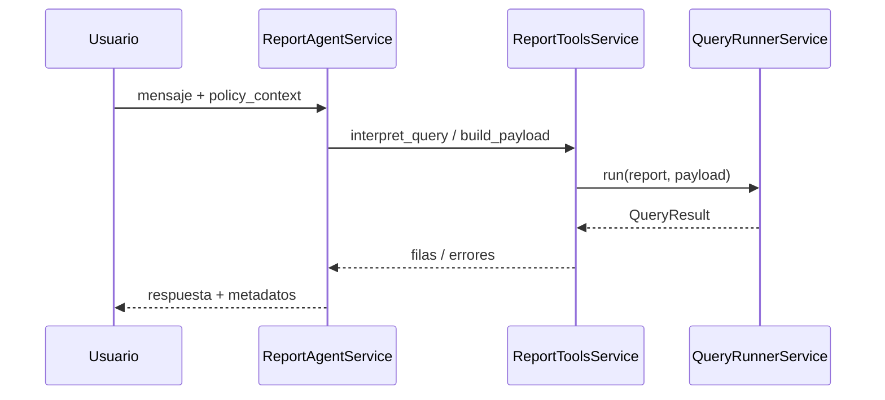

# Design: Mapeo endpoints reportes ↔ IA

## Enfoque técnico

La **fuente de verdad normativa** del contrato REST bajo `/api/reports/` es el delta spec `openspec/changes/mapeo-endpoints-reportes-ia/specs/reports-api-ia-bridge/spec.md`, alineado con las rutas reales definidas en `reports/api_urls.py`. Sobre esa base, el inventario legible para humanos y agentes puede publicarse como **markdown derivado** (p. ej. `docs/reports/` o `ia/agents/reportes/`), generado manualmente o por script en una fase posterior; ese documento es **secundario** y debe reconciliarse con el spec en revisión.

En el código actual, `ReportAgentService` orquesta la conversación y delega en `ReportToolsService` (`interpret_query`, `build_payload`, `run_report_query`, etc.). La ejecución de consultas pasa por `QueryRunnerService(request_user).run(report, payload)` dentro de `report_tools.py`, **sin** pasar por HTTP dentro del proceso Django. Eso es coherente con el spec: el contrato HTTP documenta el comportamiento observable para clientes externos y para futuras herramientas; **no** se impone un "loop" HTTP obligatorio para el agente embebido. La alineación consiste en que los mismos conceptos (payload de `query`, permisos operacional/gerencial, dependencia de sesión para filtros) aplican tanto a la vista DRF como al runner directo.

Objetivo de la fase de aplicación: mantener `ReportToolsService` **semánticamente alineado** con el contrato documentado (campos, permisos, precondiciones de `base_empresa`) y añadir referencias cruzadas en documentación; cualquier cliente HTTP interno (p. ej. agente desacoplado) queda como **extensión opcional**, no como requisito del núcleo actual.

## Decisiones de arquitectura (ADR)

| ADR | Elección | Alternativas | Fundamento |
|-----|----------|--------------|------------|
| **Consumo del contrato** | Spec OpenSpec + markdown opcional generado/curado; implementación del agente vía `ReportToolsService` + `QueryRunnerService`. | Cliente HTTP interno que replique todas las llamadas a `/api/reports/`. | Evita latencia, doble serialización y duplicación de autenticación en el mismo proceso; el spec sigue siendo el contrato común con el mundo exterior. Un cliente HTTP sería razonable para un servicio desplegado aparte, no para el flujo in-process actual. |
| **Sesión / `base_empresa`** | El spec exige sesión con `base_empresa` para `GET /api/reports/filters/`; el agente ya expone contexto vía `get_user_context` (`policy_context.base_empresa`). Para **futura** exposición "API-from-agent" o herramientas que llamen HTTP, documentar y reutilizar el mismo criterio de sesión (cookies / cabeceras según arquitectura desplegada). | Inferir base solo desde cabecera ad-hoc o parámetros sin alinear a sesión Synap. | Coherencia con DRF y con el 400 actual de filtros; reduce fugas de contexto entre distintos frontends. |
| **Inventario de rutas amplias** | Listar en doc complementaria (no en el spec mínimo) rutas `executive-summary`, relays `ventas-netas`, `reconciliacion-movimiento-detalle`, `builder/reference-values`, etc., como señaló el spec opcional. | Incluir todo en el spec delta en la misma entrega. | Mantiene el spec enfocado en el núcleo MUST; el inventario extendido evoluciona sin inflar requisitos normativos inmediatos. |

## Flujo de datos (ASCII)

```
Usuario (chat/UI)
    → Orquestador IA (p. ej. ReportAgentService)
         → ReportToolsService (interpretación, permisos, payload)
              → QueryRunnerService.run(report, payload)   [camino actual, in-process]
         → (futuro opcional) Cliente HTTP → /api/reports/query|filters|...   [mismo contrato, otro despliegue]
    ← Respuesta natural language + payload estructurado
```

Vistas DRF bajo `reports/api_urls.py` atienden clientes HTTP con el **mismo** dominio de permisos y payload que el runner, divergiendo solo en el transporte.

## Secuencia (flujo principal del agente)



## Archivos a tocar (próxima fase — sdd-apply)

| Ruta | Acción | Notas |
|------|--------|--------|
| `docs/reports/REPORTS_API_IA.md` o `ia/agents/reportes/TOOLS.md` | Crear/actualizar | Inventario: método, ruta, permisos, parámetros; enlace al spec. **Próxima fase sdd-apply.** |
| `ia/agents/reportes/manifest.json` (opcional) | Crear | Lista machine-readable de endpoints priorizados MUST/SHOULD; **próxima fase sdd-apply** si se automatiza. |
| `openspec/changes/.../specs/.../spec.md` | Revisar tras cerrar | Sin cambio en esta tarea de diseño si el spec ya está aprobado. |
| `reports/api_urls.py` | Solo referencia | Mapa de paths; alineación en PR, sin refactor. |

*No se modifica código de producción Python en el trabajo de diseño actual.*

## Estrategia de pruebas

| Capa | Qué | Cómo |
|------|-----|------|
| Unit | Helpers de mapeo o validación de payload (si se añaden en sdd-apply) | `pytest` en módulo `ia` o `reports`; **sin** `@pytest.mark.integration` salvo que toquen MySQL. |
| Integración | Endpoints bajo `/api/reports/` | Marcador `integration` según `openspec/config.yaml` / `pytest.ini`; comando habitual: `docker exec Synap_app pytest` con criterio del proyecto. |
| Manual / contrato | `POST /api/reports/query/`, `GET /api/reports/filters/?type=...`, `GET .../schema/` | Sesión autenticada **con** `base_empresa` establecida; comprobar 400 de filtros sin base; comprobar 403 con usuario sin permiso al tipo de reporte. Contrastar cuerpos con el spec. |

## Migración y despliegue

Sin migraciones de datos ni feature flags: cambios documentales y, en fase apply, añadidos de docs o artefactos opcionales.

## Preguntas abiertas

- ¿Nombre y ubicación final del markdown generado (`docs/reports/` vs `ia/agents/reportes/`) y si se añade generación en CI?
- Si en el futuro se expone un agente solo vía API REST, ¿se formaliza un OpenAPI a partir del spec o basta con el delta OpenSpec + checklist manual?
