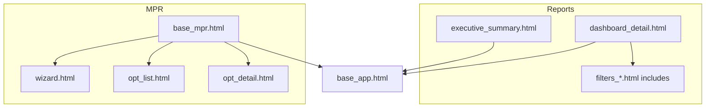

# Design: Fuente de verdad UX/UI — Reportes dashboard y MPR (wizard / OPT)

## Enfoque técnico

Esta entrega es **solo documentación y normativa OpenSpec**: no se modifican vistas, plantillas ni estáticos de `reports/` o `mpr/`. El diseño describe **qué archivos son la referencia** y **cómo consumirlos** para mantener coherencia visual y de UX.

## Decisiones de arquitectura

### Decisión: Canon por rutas y plantillas, no por “app” genérica

**Elección:** La fuente de verdad se ancla a **rutas HTTP** y **plantillas concretas**, no al nombre genérico “Django app”.

**Alternativas consideradas:** Declarar solo “app `reports`” o “app `mpr`” (demasiado amplio: incluiría builder, catálogo, etc., no todos son patrón del mismo dashboard).

**Rationale:** Los informes operativos en `/reports/dashboard/<slug>/` comparten un shell; el builder y el data map son herramientas distintas. El diseño del cambio **centra el canon en el dashboard por slug** y en **wizard + OPT** en MPR, alineado con la decisión de producto.

### Decisión: Scripts por slug de objetivos no definen el canon de “Ventas”

**Elección:** Los slugs que cargan `objetivos_ventas_bo.js` forman parte del **runtime** del dashboard de reportes; el **patrón de shell** (hero, filtros, modales) sigue siendo referencia. La **lógica y presentación específica** de esos informes **no** extiende el permiso de citar `ventas/templates/` como referencia de migración.

**Alternativas consideradas:** Excluir por completo esos slugs del canon (confuso porque comparten plantilla).

**Rationale:** Separar **contenedor** (canónico) de **contenido/JS de negocio** (objetivos en rediseño a nivel producto).

### Decisión: Un único documento en `docs/general/`

**Elección:** `docs/general/FUENTE_VERDAD_UI_REPORTES_MPR.md` con tablas y enlaces a rutas de código.

**Alternativas:** Solo OpenSpec sin doc (insuficiente para humanos fuera del flujo SDD); duplicar en `docs/reports/` y `docs/mpr/` (riesgo de divergencia).

**Rationale:** Una sola fuente legible; OpenSpec exige comportamiento; el doc exige inventario.

## Flujo de datos (documental)

```text
Desarrollador / agente
        │
        ▼
docs/general/FUENTE_VERDAD_UI_REPORTES_MPR.md  ──►  Plantillas y estáticos listados
        │
        ▼
openspec/specs/.../ui-fuente-verdad-reportes-mpr  (tras archivo) ──►  MUST / MUST NOT
```

## Archivos de referencia (inventario técnico)

### Reportes — dashboard

| Rol | Ruta en repo |
|-----|----------------|
| Vista | `reports/views.py` → `DashboardDetailView` |
| Plantilla principal | `reports/templates/reports/dashboard_detail.html` |
| Resumen ejecutivo (slug específico) | `reports/templates/reports/executive_summary.html` |
| Filtros (includes) | `reports/templates/reports/includes/filters_*.html` |
| Modales / toolbar logística | `reports/templates/reports/includes/logistica_lista_comprobantes_rutas_*.html` |
| Runtime declarativo | `reports/static/reports/js/widget_engine.js`, vendor D3 |
| Runtime legacy | `reports/static/reports/js/dashboard.js` (módulo), scripts por slug |

### MPR — wizard y OPT

| Rol | Ruta en repo |
|-----|----------------|
| URLs | `mpr/urls.py` (`wizard`, `opt_list`, `opt_detail`, …) |
| Layout | `mpr/templates/mpr/base_mpr.html` |
| Asistente | `mpr/templates/mpr/wizard.html` |
| Listado OPT | `mpr/templates/mpr/opt_list.html` |
| Detalle OPT | `mpr/templates/mpr/opt_detail.html` |
| Modal carga POST | `mpr/templates/mpr/includes/mpr_post_loading_modal.html` |

### Excluido como referencia UI (hasta nuevo aviso)

| Área | Ruta / prefijo |
|------|----------------|
| Objetivos de venta | `ventas/templates/ventas/objetivos_*.html`, rutas `/ventas/objetivos-venta/` |
| Presupuestos | `ventas/templates/ventas/presupuesto_*.html`, rutas `/ventas/presupuestos/` |

## Diagrama de dependencias de plantillas



## Deuda técnica visual (fuera del alcance inmediato)

- Unificación gradual de escalas `gray-*` vs `slate-*` entre MPR y reportes.
- Revisión de doble carga Tailwind/Alpine en shell global (`theme/templates/base_app.html`) no forma parte de este cambio.

## Verificación

- Existencia de `docs/general/FUENTE_VERDAD_UI_REPORTES_MPR.md`.
- `openspec/config.yaml` referencia el cambio o la política de canon en `rules.proposal`.
- Spec delta presente y coherente con la propuesta.
