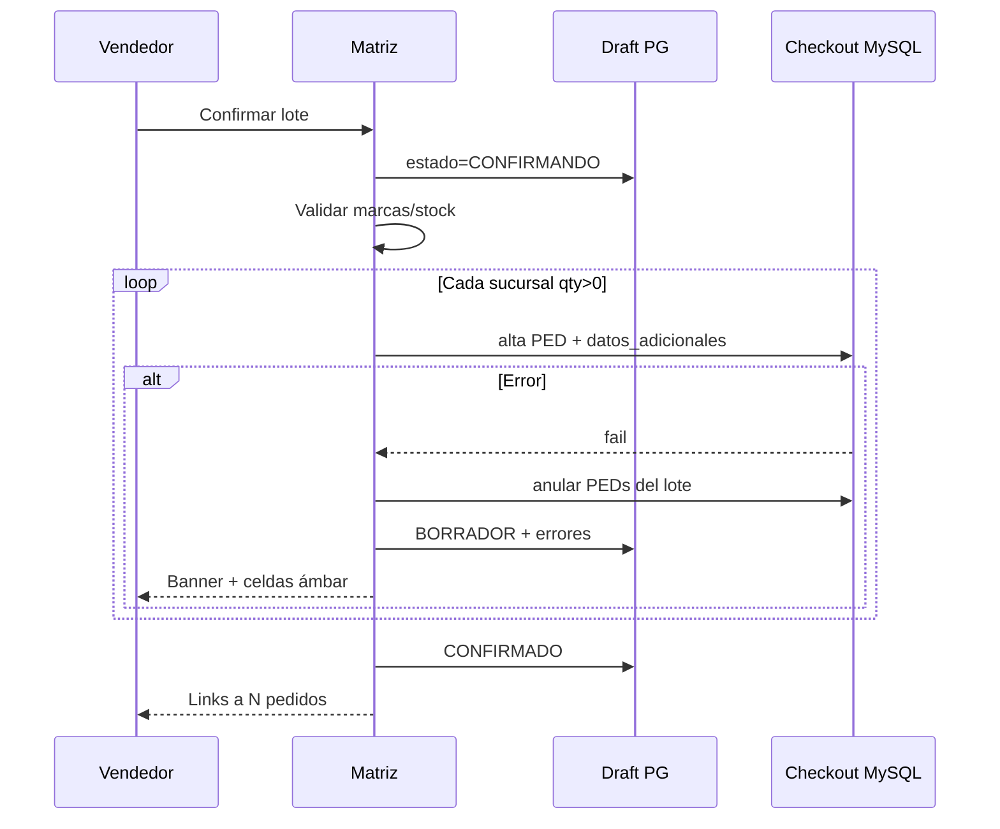

# Design — Pedidos hub kanban + masivo sucursales

**Change:** `ecom-pedidos-hub-kanban-masivo-sucursales`  
**Fecha:** 13/07/2026  
**Canon UI:** `mpr/templates/mpr/tablero_produccion.html` (header slate-800, viewport flex, tabla sticky).  
**No usar:** pantallas Objetivos/Presupuestos en `ventas/`.

## 1. Arquitectura

```
/ecom/mayoristapp/pedidos/          ← Home Lista|Kanban (refactor hub)
         │
         ├─ Continuar borrador simple → /compra/ (EcomCart)
         ├─ Continuar borrador masivo → /pedido-masivo-sucursales/
         ├─ Ver PED                  → /pedidos/<cod_mov>/
         └─ Nuevo ▾
              ├─ Simple              → /compra/
              └─ Masivo sucursales   → /pedido-masivo-sucursales/

/ecom/mayoristapp/config/vendedor-cliente-marca/   ← Supervisor
```

```
[UI Hub] → ecom/services/pedidos_hub_pipeline.py
              ├─ borradores EcomCart + EcomPedidoMasivoDraft
              └─ PED Admin (comp_ped + flags autorización/prep)

[UI Matriz] → draft service (autoguardado)
           → batch_checkout_masivo()
                for each sucursal qty>0:
                  reusa mayorista_checkout_service
                  cliente_datos_adicionales.id_cliente_domicilio
                on any failure: rollback escritos + draft.BORRADOR + errores[]
```

## 2. Decisiones

| ID | Decisión | Razón |
|----|----------|-------|
| D1 | 1 PED por `cliente_domicilio` | Paridad Admin / rutas / datos adicionales |
| D2 | Borrador masivo en **Postgres** Synap | Igual filosofía EcomCart; no ensucia MySQL |
| D3 | Ternas Vendedor-Cliente-Marca en **MySQL** snake_case vía catálogo | Visible a otras herramientas Admin; scope `base_empresa` implícito por DB |
| D4 | Unique `(id_cliente, CodMarca)` | Exclusividad de marca por cliente entre vendedores |
| D5 | Hub reemplaza KPIs-only; listado vendedor y kanban depósito se enlazan/filtran | Una sola home |
| D6 | Kanban sin DnD de estados Admin | Evitar writes ilegales; Autorizar = acción explícita |
| D7 | Pack = presentación/UOM del artículo (misma regla compra) | Consistencia precios |

## 3. Modelo de datos

### Postgres (`ecom`)

`EcomPedidoMasivoDraft` / `EcomPedidoMasivoDraftCelda`:
- `base_empresa`, `id_usuario`, `cod_viajante`, `id_cliente`
- `estado`: BORRADOR | CONFIRMANDO | CONFIRMADO | ARCHIVADO
- `ultimo_error` (JSON: sucursal → mensaje)
- Celdas: `id_articulo`, `id_cliente_domicilio`, `cantidad_packs` (decimal/int)

### MySQL legacy (catálogo + `ecom/sql/`)

`ecom_vendedor_cliente_marca`:
- `id`, `CodViajante`, `id_cliente`, `CodMarca`, auditoría, `anulado`
- UNIQUE `(id_cliente, CodMarca)` WHERE no anulado

`ecom_usuario_viajante` (si sesión insuficiente):
- UNIQUE `id_usuario` → `CodViajante` (patrón MPR)

## 4. Estados Hub (Lista + Kanban)

| Columna | Origen |
|---------|--------|
| Borrador | Drafts masivo + EcomCart con ítems |
| Enviado | PED confirmado reciente, no autorizado (si aplica flujo) |
| Por autorizar | PED pendiente autorización |
| Aprobado | Autorizado / en preparación |
| Anulado | Anulados (ventana reciente) |

Tarjeta: tipo (Simple/Masivo N), cliente, fecha `dd/MM/yyyy`, packs/total, badge error si `ultimo_error`.

## 5. Flujos clave

### Recuperar borrador
1. Entrada a `/pedidos/` lista drafts del usuario.
2. Click → matriz/compra con datos.
3. Nuevo con draft activo → modal Continuar | Archivar y crear.

### Confirmación masiva
1. Draft → CONFIRMANDO (lock).
2. Por cada sucursal con Σ>0: checkout (transacción MySQL por PED).
3. Si falla uno: compensar/anular PEDs del lote ya creados en la misma corrida **o** no commit hasta validar todo en dry-run previo + commits secuenciales con lista de creados y reverse on fail.
4. Draft → BORRADOR + `ultimo_error`; UI banner.
5. Si OK: CONFIRMADO + ids `CodigoMovimiento[]`.

**Estrategia preferida:** validación previa (stock, cliente, marcas) → luego creates; si create N falla, anular N..1 del lote y restaurar draft.

### Config marcas
POST crea terna; si unique violation → 409 con vendedor dueño. UI multi-select marca muestra ocupadas.

## 6. Permisos

| Key | Uso |
|-----|-----|
| `ecom.pedidos.ver` (existente / ajustar) | Hub |
| `ecom.pedido_masivo.usar` | Matriz |
| `ecom.config_vendedor_cliente_marca` | ABM ternas |
| Autorizar | Reusar permiso autorización PED actual |

## 7. UI shell (matriz + hub)

Misma estructura que tablero producción:
- `h-[calc(100dvh-4.5rem)]`, header `bg-slate-800`, breadcrumb purple
- Matriz: sticky col artículo + sticky header sucursales + scroll
- Autoguardado debounce 400–800 ms + chip “Guardado”

## 8. Secuencia batch (mermaid)



## 9. Testing

- Unit: unique marca, filtro catálogo, serialización draft
- Integration (docker): batch OK; batch fail mid-way → 0 PED netos + draft intacto
- UI smoke: hub muestra draft; recuperar tras “reload”

## 10. Docs

- `docs/ecom/PEDIDOS_HUB_KANBAN.md`
- `docs/ecom/PEDIDO_MASIVO_SUCURSALES.md`
- `docs/ecom/VENDEDOR_CLIENTE_MARCA.md`
