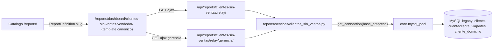

# Design: Informe clientes sin ventas por vendedor

**Change:** `informe-clientes-sin-ventas-vendedor`
**Spec:** [specs/reports-clientes-sin-ventas/spec.md](./specs/reports-clientes-sin-ventas/spec.md)
**Patrón de referencia:** `reports/services/ventas_netas.py` + [reports/ventas_netas_relay_views.py](../../../reports/ventas_netas_relay_views.py) (relay legacy) y `reports/logistica_lista_comprobantes_rutas_views.py` (informe legacy con vista propia).

## Arquitectura

## Componentes y archivos concretos

### 1. Servicio `reports/services/clientes_sin_ventas.py` (nuevo)
Funciones puras (reciben `conn` o `base_empresa`), SQL parametrizado:

- `listado_vendedores_seleccion(conn, *, permiso_gerencial, supervisor_venta, vendedor_a_cargo, cod_viajante_propio) -> list[dict]`
  Traduce `listado_vendedores()`. `SELECT CodViajante, CONCAT(Nombre,...) FROM viajantes WHERE Anulado='No'` + cláusula `IN (%s,...)` con IDs `int`. Devuelve `[{label, value}]`.
- `parse_filtrar_por(raw) -> list[int]`
  Reemplaza el parseo `explode('||')`/`explode('|')`; extrae solo pares `vendedor|<id numérico>`, descarta el resto, normaliza a `int` (defensa REQ-CSV-004).
- `get_clientes_sin_ventas(base_empresa, *, fecha_desde, fecha_hasta, cod_viajantes_filtro, permiso_gerencial, supervisor_venta, vendedor_a_cargo, cod_viajante_propio, todos_clientes, usa_id_manual, incluir_domicilio) -> dict`
  Traduce `clientes_sin_ventas()`. Devuelve `{columns, datos, resumenVendedores, resumenGlobal, modoTodosVendedores, totales}`.

**Reglas de traducción SQL (parametrizado):**
- Fechas: `AND cc_periodo.Fecha BETWEEN %s AND %s` (params `fecha_desde`, `fecha_hasta` ya validadas por `parse_date`).
- Cláusula vendedor: construir `IN (%s, %s, ...)` con placeholders segun cantidad de IDs `int` (nunca interpolar strings).
- `campoId`: expresión fija segun `usa_id_manual` (`COALESCE(NULLIF(cliente.id_manual_cli,''), cliente.Codigo)` o `cliente.Codigo`) — es SQL constante, no entrada de usuario.
- `campoDomicilio`: subconsulta constante activada por flag booleano `incluir_domicilio` (no interpola valores).
- `UltimaCompra`: subconsulta `MAX(cc2.Fecha)` excluyendo NCA/NCB.
- Resumen: segunda consulta agregada (`COUNT(DISTINCT CASE WHEN ...)`) con la misma cláusula de vendedor.
- Tipos: `to_date_or_none`, `to_int_or_none`, `str_or_default` de `core.utils.administranet_types`; fecha a usuario dd/MM/yyyy.

### 2. Relay API `reports/clientes_sin_ventas_relay_views.py` (nuevo)
Dos APIViews DRF (patrón `VentasNetasRelay*`):

- `ClientesSinVentasRelayAPIView` (`OperationalReportsPermission`): fuerza scope al vendedor de sesión (`id_vendedor_usr`), salvo `vendedor_a_cargo`. Ignora `filtrarPor` que intente ampliar más allá del alcance permitido.
- `ClientesSinVentasGerenciaRelayAPIView` (`ManagerialReportsPermission`): respeta `filtrarPor` y `vendedor_a_cargo`; sin filtro → todos.

Helpers reutilizados/replicados: `_session_user`, `_base_empresa`, `_parse_date_qs`, `_parse_bool_qs`, `_vendedor_a_cargo_from_session`. Validación 400 si faltan fechas (modo distinto de `seleccion`).

Claves de sesión mapeadas (con defaults seguros): `base_empresa`, `id_vendedor_usr` (CodViajante), `inf_gerenciales`, `supervisor_venta`, `vendedor_a_cargo`, `todos_clientes`, `usa_id_manual`, `usa_domicilio_cliente_informes`.

### 3. Rutas `reports/api_urls.py` (modificar)
Registrar junto a las de ventas netas:
- `clientes-sin-ventas/relay/` → `ClientesSinVentasRelayAPIView` (name `reports-clientes-sin-ventas-relay`).
- `clientes-sin-ventas/relay/gerencia/` → `ClientesSinVentasGerenciaRelayAPIView` (name `reports-clientes-sin-ventas-relay-gerencia`).

### 4. UI canónica
- Añadir rama de slug en `DashboardDetailView.get_template_names` (`reports/views.py`) para `clientes-sin-ventas-vendedor` → `reports/dashboard_clientes_sin_ventas_vendedor.html` (precedente: `EXECUTIVE_SLUG`, `COMMAND_CENTER_SLUG`).
- Plantilla nueva `reports/templates/reports/dashboard_clientes_sin_ventas_vendedor.html` extendiendo la base del dashboard canónico; filtros de período (fechaDesde/fechaHasta), selector de vendedor (autocomplete vía modo `seleccion`), checkbox "incluir domicilio"; tabla de resultados y bloque de gráfico (por vendedor / global segun `modoTodosVendedores`). Reutiliza includes de `reports/includes/`. Consume la relay API por `fetch`.
- Sin usar como referencia visual las pantallas de `ventas/` (regla de canon UI).

### 5. `ReportDefinition` `reports/migrations/00XX_add_clientes_sin_ventas_report.py` (nuevo)
`update_or_create(slug="clientes-sin-ventas-vendedor", empresa=None, defaults={name, description, category, config{filters}, metadata, is_active=True})`. Patrón de [0008_add_ventas_netas_report.py](../../../reports/migrations/0008_add_ventas_netas_report.py), con guarda de existencia de tabla. `category`: `operational` (visible operativo; el relay gerencial se usa segun permiso). Incluir `catalog_legacy_section`/`catalog_legacy_order` en metadata si aplica (ver TODO.md de ecom). `reverse` elimina el ReportDefinition.

### 6. Checkpoint
Registrar `EcomMigrationCheckpoint(module_slug="mayoristapp_informe_clientes_sin_ventas")` en la misma migración de datos o una dedicada.

## Decisiones de diseño

- **Operativo vs gerencial:** dos endpoints como en ventas netas, para no filtrar de más ni de menos y evitar bypass (REQ-CSV-004).
- **Sin escritura legacy:** informe de solo lectura; sin hooks de commit.
- **Gráficos:** se calculan en backend (`resumenVendedores`/`resumenGlobal`); el front solo renderiza (Chart.js del stack canónico).
- **Paridad de conteos:** se valida forma en tests unitarios; la paridad numérica fina contra BD real queda para validación operativa (Fase D), como el resto del módulo.

## Impacto / compatibilidad

- No modifica endpoints existentes; solo agrega. Sin migración de esquema (solo dato `ReportDefinition`).
- Reutiliza permisos y pool existentes; sin nuevas dependencias.

## Test plan (resumen)

- `parse_filtrar_por`: pares válidos, no numéricos, vacío, inyección textual.
- Construcción de cláusula vendedor por permisos (operativo/supervisor/gerencial).
- Forma de respuesta (`datos`, `resumenVendedores`, `resumenGlobal`, `modoTodosVendedores`, `columns`).
- Relay: 400 sin fechas; 403/scope operativo; gerencial respeta filtro.
- Ejecutar en `docker exec Synap_app python manage.py test reports.tests.test_clientes_sin_ventas_relay`.
