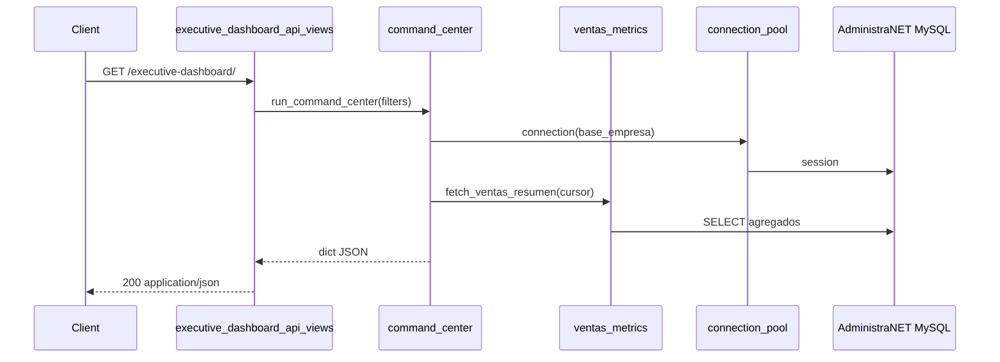

# Diseño técnico — API Dashboard gerencial (legacy)

**Cambio:** `dashboard-gerencial-endpoints-legacy`  
**Fecha:** 11/05/2026  
**Spec:** `specs/reports-executive-dashboard/spec.md`

---

## 1. Enfoque técnico

Introducir un **módulo de métricas de solo lectura** (`reports/services/executive_dashboard/`) y vistas API delgadas que **no** pasen por `ReportDefinition` ni `QueryRunnerService.run()`. La extracción de SQL existente se hace **copiando la lógica probada** a funciones puras que reciben `cursor` + `DashboardFilters`, evitando en P0 refactorizar el monolito `query_runner.py` (fase S4 opcional).

El orquestador compone respuestas de sub-servicios en un solo JSON para CEO View; cada área expone también su endpoint para cache y paralelismo en Manager View.

---

## 2. Decisiones de arquitectura

### Decisión: Namespace API dedicado

**Elección:** Prefijo `/api/reports/executive-dashboard/` (no ampliar `executive-summary`).

**Alternativas:** Reutilizar solo `POST /api/reports/query/` con slugs; extender `executive-summary` con query `modo=periodo`.

**Rationale:** Contrato KPI estable, GET cacheable, separación Application/Legacy clara; `query/` retorna grillas y permite sample data en slugs no implementados.

### Decisión: Extracción incremental vs refactor inmediato de QueryRunner

**Elección:** P0 — **copiar** métodos privados relevantes a `*_metrics.py` y dejar `QueryRunnerService` intacto.

**Alternativas:** Refactor único importando desde métricas en el mismo PR.

**Rationale:** Evolution Mode — no romper informes; reducir riesgo de regresión en 4400+ líneas. S4 delega `QueryRunnerService._get_ventas_netas_total` → `ventas_metrics.get_ventas_netas_total`.

### Decisión: Orquestador en modo degradado

**Elección:** Por área, capturar excepciones `LegacyReadError` / `MprSchemaError` → `disponible: false`; ventas con fallo transitorio → **503** en orquestador completo.

**Alternativas:** Siempre 503 si falla una área; siempre 200 parcial.

**Rationale:** Inventario/MPR pueden fallar sin bloquear lectura de ventas del período; ventas es KPI crítico del command center.

### Decisión: Manufactura vía `mpr.services`

**Elección:** Nuevo `manufacturing_metrics.py` que llama funciones existentes (`listar_pedidos_fabrica`, `listar_opt_listado`, `listar_lista_produccion_agrupada`, `listar_ventana_pack`).

**Alternativas:** Duplicar SQL MPR en `reports/`; solo informes slug `mpr-*` vía query.

**Rationale:** Paridad con `TableroView`; una sola fuente de verdad MPR.

### Decisión: Compras desde subconsulta OC de BO

**Elección:** `purchase_metrics.py` con SQL agregado alineado a `oc_pendiente_sub` del informe BO (líneas ~3684–3696 de `query_runner.py`).

**Alternativas:** `stock_deposito.saldo_pedido_proveedor`; informe seed `compras_cumplimiento`.

**Rationale:** Audit y BO ya documentan que saldo_pedido_proveedor **no** debe usarse.

### Decisión: P1 detalle delegando runners existentes

**Elección:** `ventas_metrics.list_pedidos_pendientes` invoca lógica extraída de `_run_pending_orders` / `_run_uninvoiced_remitos` con `LIMIT/OFFSET`.

**Alternativas:** Exponer `POST /query/` con slug desde el cliente.

**Rationale:** Cumple REQ-ED sin UI; paginación server-side obligatoria.

---

## 3. Estructura de archivos

```
reports/
  executive_dashboard_api_views.py    # APIView por ruta + mixin filtros
  api_urls.py                         # + urlpatterns executive-dashboard/*
  services/
    executive_dashboard/
      __init__.py
      base.py                         # DashboardFilters, resolve_period, with_legacy_cursor
      exceptions.py                   # LegacyReadError
      ventas_metrics.py
      inventory_metrics.py
      purchase_metrics.py
      manufacturing_metrics.py
      cross_metrics.py
      command_center.py
  tests/
    test_executive_dashboard_contract.py
    test_executive_dashboard_api.py   # opcional: APIClient mock permisos
```

**No crear en P0:** plantillas, JS, migraciones PostgreSQL (salvo que se necesite caché en PG — no requerido).

---

## 4. Capa base (`base.py`)

### `DashboardFilters` (dataclass)

```python
@dataclass(frozen=True)
class DashboardFilters:
    base_empresa: str
    fecha_referencia: date
    fecha_inicio: date
    fecha_fin: date
    cod_sucursal: int | None
    limit: int = 100
    offset: int = 0
```

### `resolve_filters(request) -> DashboardFilters`

- Reutilizar parsers de `executive_summary_api_views` (`_parse_fecha`, `_parse_cod_sucursal`).
- Default período: `fecha_inicio = fecha_referencia.replace(day=1)`, `fecha_fin = fecha_referencia`.
- Validar `fecha_inicio <= fecha_fin` → raise `InvalidDashboardFilters`.

### `with_legacy_cursor(base_empresa) -> contextmanager`

- Usar `get_mysql_pool().connection(base_empresa)` o patrón existente en `connection_pool.py`.
- `SET SESSION max_execution_time` como en informes (300000 ms).
- Charset `latin1` coherente con `query_runner`.

### `build_meta(filters, **extra) -> dict`

- Cumple REQ-ED-META-01.

---

## 5. Servicios por área

### 5.1 `ventas_metrics.py`

| Función | Origen |
|---------|--------|
| `fetch_ventas_resumen(cursor, filters)` | `_get_ventas_netas_total`, `_get_remitos_no_facturados_total`, `_get_pedidos_pendientes_total` |
| `list_pedidos_pendientes(...)` | `_run_pending_orders` (SQL filas) |
| `list_remitos_no_facturados(...)` | `_run_uninvoiced_remitos` |

**Parámetros SQL:** fechas como `str` `YYYY-MM-DD` igual que query_runner; sucursal → lista `[cod_sucursal]`; `filtrar_por_fecha=True` en pedidos para resumen período.

**Shape resumen:**

```json
{
  "ventas_netas": 0.0,
  "remitos_no_facturados_monto": 0.0,
  "pedidos_pendientes_monto": 0.0,
  "total_operativo": 0.0,
  "pedidos_pendientes_cantidad": null,
  "disponible": true,
  "meta": { "...": "..." }
}
```

### 5.2 `inventory_metrics.py`

| Función | Origen |
|---------|--------|
| `fetch_inventario_resumen(cursor, filters)` | Agregados derivados de `_run_stock_existencias` |

**Implementación v1:** una o dos consultas agregadas:

- `valor_stock`: `SUM(sd.saldo * precio_lista)` con join `articulo`, lista precio default 2 (`Precio1V`).
- `productos_bajo_minimo`: subquery reservado (misma lógica BO: `stockp`+`comp_ped` PED) + comparación `PuntoPedido`.

**Nota:** `sucursal` ignorada en v1 con nota en meta.

### 5.3 `purchase_metrics.py`

| Función | SQL |
|---------|-----|
| `fetch_compras_resumen(cursor, filters)` | Agregado global sobre OC pendiente (sin join BO completo por artículo) |

```sql
-- Esquema conceptual (alineado BO)
SELECT
  COUNT(DISTINCT cp_oc.CodigoMovimiento) AS oc_pendientes_cantidad,
  SUM(pendiente_unidades) AS oc_pendientes_unidades,
  SUM(pendiente_importe) AS oc_pendientes_importe
FROM stockp sp_oc
INNER JOIN cuentaproveedor cp_oc ON ...
WHERE cp_oc.TipoComprobante = 'OC' AND cp_oc.Estado = 'Pendiente' ...
```

### 5.4 `manufacturing_metrics.py`

```python
def fetch_manufactura_resumen(base_empresa: str) -> dict:
    try:
        agrupada = listar_lista_produccion_agrupada(...)
        ...
    except MprSchemaError as e:
        return {"disponible": False, "error": {"tipo": "mpr_schema_not_ready", "mensaje": str(e)}}
```

- Para conteos exactos, preferir consultas COUNT en servicios MPR si existen; si no, usar listados con límite alto documentado en `meta.notas_semanticas` (deuda técnica explícita).

### 5.5 `cross_metrics.py`

| Función | Origen |
|---------|--------|
| `fetch_cruzados_resumen(cursor, filters)` | Agregación sobre SQL BO sin materializar 1000 filas en Python |

**Estrategia:** ejecutar `sql_bo_detalle` envuelto en subquery:

```sql
SELECT SUM(bo_importe), SUM(bo_qty), SUM(stock_reservado) FROM ( ... sql_bo_detalle ... ) t
```

Reutilizar `parse_fecha_bo_yyyymmdd` para fechas `stockp.Fecha`.

**Parámetros opcionales** (query string): `fecha_inicio_facturacion`, `fecha_fin_facturacion` para `facturacion_periodo` vía `_get_ventas_netas_total`.

### 5.6 `command_center.py`

```python
def run_command_center(filters: DashboardFilters) -> dict:
    areas = {}
    with with_legacy_cursor(filters.base_empresa) as cursor:
        areas["ventas"] = fetch_ventas_resumen(cursor, filters)
        areas["inventario"] = safe_area(lambda: fetch_inventario_resumen(cursor, filters))
        ...
    areas["crm"] = {"disponible": False, "motivo": "..."}
    areas["manufactura"] = fetch_manufactura_resumen(filters.base_empresa)  # sin cursor legacy
    return {"fecha_referencia": ..., "periodo": ..., "areas": areas, "meta": build_meta(...)}
```

---

## 6. Capa API (`executive_dashboard_api_views.py`)

### Mixin `ExecutiveDashboardMixin`

- `permission_classes = [ManagerialReportsPermission]`
- `get_filters(self, request) -> DashboardFilters`
- `legacy_error_response(exc) -> Response 503`

### Vistas

| Clase | Método | Servicio |
|-------|--------|----------|
| `ExecutiveDashboardAPIView` | GET | `run_command_center` |
| `ExecutiveDashboardVentasResumenAPIView` | GET | `fetch_ventas_resumen` |
| `ExecutiveDashboardInventarioResumenAPIView` | GET | `fetch_inventario_resumen` |
| `ExecutiveDashboardComprasResumenAPIView` | GET | `fetch_compras_resumen` |
| `ExecutiveDashboardManufacturaResumenAPIView` | GET | `fetch_manufactura_resumen` |
| `ExecutiveDashboardCruzadosResumenAPIView` | GET | `fetch_cruzados_resumen` |
| P1: `...PedidosPendientesAPIView`, etc. | GET | list_* |

### Registro URLs (`api_urls.py`)

```python
path("executive-dashboard/", ExecutiveDashboardAPIView.as_view(), name="reports-executive-dashboard"),
path("executive-dashboard/ventas/resumen/", ...),
# ...
```

---

## 7. Flujo de datos



---

## 8. Caché

- Clave: `executive_dashboard:{endpoint}:{base_empresa}:{fecha_inicio}:{fecha_fin}:{sucursal}`.
- TTL: reutilizar `_get_cache_ttl` de query_runner o constante 300 s para resúmenes P0.
- Bypass con query `?nocache=1` (opcional, mismo patrón informes).

---

## 9. Tests

### `test_executive_dashboard_contract.py` (SimpleTestCase)

- Mock `cursor` con `fetchone`/`fetchall` secuenciados.
- Assert keys obligatorios por `fetch_*_resumen` y `run_command_center`.
- Assert `meta.definicion == "executive-dashboard-v1"`.
- Assert `total_operativo` = suma de tres montos ventas.

### `test_executive_dashboard_api.py` (opcional)

- `APIClient` + override permiso gerencial.
- 400 sin base_empresa en sesión.
- 400 fechas invertidas.

**Ejecución:** `docker exec Synap_app python manage.py test reports.tests.test_executive_dashboard_contract`

---

## 10. Plan de implementación (tasks)

| ID | Tarea | Depende |
|----|-------|---------|
| T1 | `base.py` + `exceptions.py` + filtros | — |
| T2 | `ventas_metrics.py` + tests contrato ventas | T1 |
| T3 | Vistas ventas/resumen + URL | T2 |
| T4 | `inventory_metrics.py` + vista | T1 |
| T5 | `purchase_metrics.py` + vista | T1 |
| T6 | `manufacturing_metrics.py` + vista | T1 |
| T7 | `cross_metrics.py` + vista | T1 |
| T8 | `command_center.py` + orquestador + URL | T2–T7 |
| T9 | Tests API mínimos + documentación `docs/reports/EXECUTIVE_DASHBOARD_API.md` | T8 |
| T10 (P1) | Endpoints detalle paginados | T2,T4,T7 |

---

## 11. Riesgos técnicos y mitigación

| Riesgo | Mitigación |
|--------|------------|
| Duplicación SQL con query_runner | Comentario `@legacy-parity: query_runner._get_ventas_netas_total`; test de paridad opcional con mismo cursor |
| Timeout BO agregado | `max_execution_time`; índices existentes; no devolver detalle en P0 |
| MPR list limit 500 | Meta nota; futuro COUNT en mpr.services |
| Charset / fechas BO INT | Usar `parse_fecha_bo_yyyymmdd` importado desde util existente |

---

## 12. Fuera de alcance del diseño

- UI Command Center.
- Refactor `query_runner` imports (S4).
- CRM endpoints reales.
- Materialized views / warehouse.
