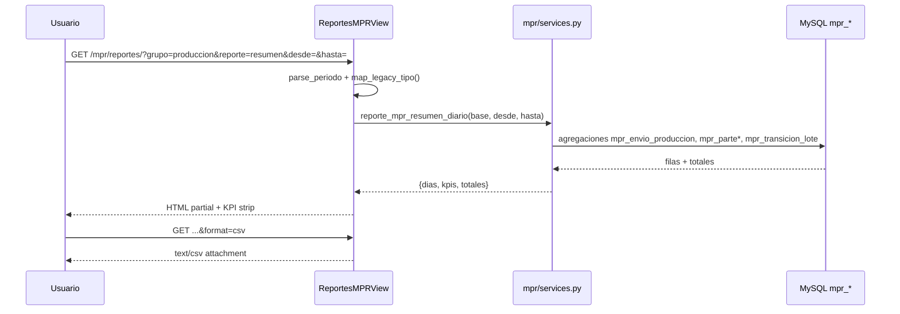

# Design: Reportes MPR — trazabilidad y producción visual

**Change:** `mpr-reportes-trazabilidad-produccion`  
**Propuesta:** [proposal.md](./proposal.md)  
**Specs:** [specs/](./specs/)

---

## Technical Approach

Refactor **`ReportesMPRView`** + **`reportes.html`** en un **hub modular** con:

1. **Capa presentación** — shell Django + partials + Alpine.js (`mprReportesHub`) para filtros/presets sin SPA.
2. **Capa servicios** — nuevos agregadores en `mpr/services.py` sobre ledgers `mpr_*`; reutilizar `listar_tablero_por_articulo` y `listar_demanda_pack_desde_pedidos`.
3. **Export** — misma vista con `?format=csv` generando CSV UTF-8 BOM desde contexto o helper `mpr/export.py`.

No se crea app nueva ni endpoints REST separados en v1; todo bajo `/mpr/reportes/`.

---

## Architecture Decisions

### Decision: Hub en `/mpr/reportes/` (no dashboard gerencial)

**Choice:** Mantener ruta MPR operativa.  
**Alternatives:** Mover a `/reports/dashboard/mpr-produccion/` con relay API.  
**Rationale:** Permisos y menú ya viven en MPR; reutilizar patrones visuales de dashboard sin duplicar permisos gerenciales.

### Decision: GET + query params (no API JSON dedicada v1)

**Choice:** `grupo`, `reporte`, `desde`, `hasta`, `id_articulo`, `format=csv`.  
**Alternatives:** HTMX partials, DRF ViewSet.  
**Rationale:** Consistente con `ReportesMPRView` actual; Alpine solo para presets y submit GET.

### Decision: Servicio nuevo operario vs mutar existente

**Choice:** `reporte_mpr_operario_parte()` nuevo; `reporte_mpr_produccion_por_operario()` intacto para legacy.  
**Alternatives:** Flag `fuente=parte` en función existente.  
**Rationale:** Evita romper tests/docs legacy; contrato spec claro.

### Decision: Fecha parte vs creado_en envío

**Choice:** Resumen diario usa fecha de negocio por etapa (envío=`creado_en`, parte=`fecha_produccion`, clasif=`creado_en`).  
**Alternatives:** Unificar todo en `creado_en`.  
**Rationale:** Alineado a cómo opera el supervisor («parte del día X»).

### Decision: Plantillas fragmentadas

**Choice:**
```
mpr/templates/mpr/reportes.html          → extends shell
mpr/templates/mpr/reportes/_shell.html
mpr/templates/mpr/reportes/_filtros.html
mpr/templates/mpr/reportes/_kpi_strip.html
mpr/templates/mpr/reportes/_nav_grupos.html
mpr/templates/mpr/reportes/partials/*.html
static/mpr/js/reportes_hub.js          → Alpine component
```
**Rationale:** Mantener `reportes.html` como entry para no romper tests que referencian template_name.

---

## UX Design (Product)

### Principios

| Principio | Aplicación |
|-----------|------------|
| Escaneo 3s | KPI strip bajo filtros |
| Narrativa pipeline | demanda → envío → parte → clasificación |
| Honestidad legacy | Histórico OPT colapsado + badge |

### Paleta semántica

| Token | Uso | Tailwind |
|-------|-----|----------|
| Pendiente | Falta cubrir | `amber-500` |
| OK | Cumplido | `emerald-600` |
| Gap | Enviado sin parte | `rose-500` |
| Scrap | Pérdida | `red-600` |
| Acento | Headers | `purple-600` |

### Layout (wireframe)

```
[ Hero slate — Reportes de producción ]
[ Filtro sticky: Desde | Hasta | Hoy 7d Mes | Export CSV ]
[ Nav: Producción | Demanda | Trazabilidad | Histórico OPT ▾ ]
[ KPI strip × 4 ]
[ Partial reporte activo: tabla | barras | timeline ]
```

Default: **Producción → Resumen diario**, preset **7 días**.

### Elementos visuales por reporte

| Reporte | Elemento no tabular |
|---------|---------------------|
| Resumen diario | KPI strip + pill gap |
| Operario | Barra % horizontal |
| Cadena | Mini-barra pipeline 3 segmentos |
| Pendiente | Badge Crítico |
| Brecha pack | Fila urgente amber |
| Trazabilidad | Timeline vertical |

Referencia canon: `tablero.html` stat-cards, `tablero_produccion.html` tablas sticky.

---

## Data Flow



---

## Servicios (nuevos / refactor)

### `reporte_mpr_resumen_diario(base_empresa, fecha_desde, fecha_hasta) -> dict`

```python
# Retorno
{
  "kpis": {"enviado": int, "parte": int, "clasificado": int, "scrap_pct": float},
  "dias": [{"fecha": date, "enviado": ..., "parte": ..., "clasificado": ..., "scrap": ..., "gap_envio_parte": ...}],
  "totales": {...},
}
```

SQL pattern: 3 subqueries agrupadas por `DATE(...)` + outer join por día calendario en rango (fill zeros).

### `reporte_mpr_operario_parte(...) -> dict`

Join `mpr_parte_linea` → `mpr_parte` → `sue_abm_empleado`. Misma shape que spec operario.

### `reporte_mpr_cadena_pipeline(...) -> dict`

Por `id_articulo`: agregaciones periodo + `estado` computado. Incluir `codigo`, `descripcion` vía `_fetch_descripciones_articulo`.

### `reporte_mpr_trazabilidad_componente(base, id_articulo, desde, hasta) -> dict`

UNION ALL eventos ordenados por timestamp. Tipos: `envio`, `parte`, `clasificacion`, `armado`.

### Refactor `reporte_mpr_brecha_demanda`

Delegar a `listar_demanda_pack_desde_pedidos` + stock terminado; calcular `brecha`, `urgente`.

### Reutilización

| Reporte | Función existente |
|---------|-------------------|
| Pendiente componentes | `listar_tablero_por_articulo(..., solo_pendiente=True)` |
| Legacy OPT | `reporte_mpr_pendiente`, `reporte_mpr_wip`, etc. sin cambio SQL |

---

## Vista `ReportesMPRView` (refactor)

```python
GRUPOS = {
  "produccion": ("resumen_diario", "operario", "cadena", "pendiente"),
  "demanda": ("brecha_pack", "pedidos_estado", "stock", "bajo_minimo"),
  "trazabilidad": ("timeline", "movimientos"),
  "legacy": ("pendiente_opt", "wip_opt", "desperdicio", "operario_opt", "opt_cerradas"),
}

LEGACY_TIPO_MAP = {
  "pendiente": ("legacy", "pendiente_opt"),
  "wip": ("legacy", "wip_opt"),
  ...
}
```

`get_context_data`:
1. `_resolver_grupo_reporte(request)` — default produccion/resumen_diario
2. `_parse_periodo(request)` — default últimos 7 días; fechas ISO internas, display dd/MM/yyyy en template filter
3. `_dispatch_reporte(base, grupo, reporte, periodo)` → `{filas, kpis, meta, partial_template}`
4. Si `format=csv` → `HttpResponse` CSV

---

## Mapeo URL legacy

| `tipo` antiguo | Nuevo |
|----------------|-------|
| `pendiente` | `grupo=legacy&reporte=pendiente_opt` |
| `wip` | `grupo=legacy&reporte=wip_opt` |
| `stock` | `grupo=demanda&reporte=stock` |
| `bajo_minimo` | `grupo=demanda&reporte=bajo_minimo` |
| `desperdicio` | `grupo=legacy&reporte=desperdicio` |
| `produccion_operario` | `grupo=produccion&reporte=operario` |
| `opt_cerradas` | `grupo=legacy&reporte=opt_cerradas` |

---

## File Changes Summary

| Archivo | Acción |
|---------|--------|
| `mpr/views.py` | Refactor `ReportesMPRView`, helper periodo, CSV |
| `mpr/services.py` | +4 servicios, refactor brecha |
| `mpr/export.py` | **Nuevo** — `filas_a_csv()` |
| `mpr/templates/mpr/reportes.html` | Delegar a shell |
| `mpr/templates/mpr/reportes/**` | **Nuevos** partials |
| `static/mpr/js/reportes_hub.js` | **Nuevo** Alpine |
| `mpr/tests/test_reportes_*.py` | Nuevos + actualizar view tests |
| `docs/mpr/REPORTES_MPR.md` | **Nuevo** catálogo |
| `docs/mpr/NAVIGACION_MPR_ETAPA11.md` | Actualizar |

---

## Test Plan

```bash
docker exec Synap_app python manage.py test \
  mpr.tests.test_reportes_mpr_view \
  mpr.tests.test_reportes_resumen_diario \
  mpr.tests.test_reportes_operario_parte \
  mpr.tests.test_reportes_cadena_pipeline \
  mpr.tests.test_reportes_trazabilidad \
  mpr.tests.test_reportes_shell_legacy_map
```

Fixtures MySQL mock (patrón `test_tablero_consolidado.py`): cursor mock con filas ledger.

Casos manuales:
- `/mpr/reportes/` default 7d
- Export CSV resumen diario
- `?tipo=pendiente` → legacy visible
- Timeline con artículo 1275 (administranet96)

---

## Rollback

Feature flag no requerido: revert commit restaura `reportes.html` y `ReportesMPRView` monolítico. Servicios nuevos son aditivos; legacy functions intactas.

---

## Documentación

- `docs/mpr/REPORTES_MPR.md` — catálogo usuario, fuentes, screenshots placeholder
- Delta specs → alinear `docs/reports/mpr/ESPEC_MPR_PRODUCCION_OPERARIO.md` en apply (fuente parte)
