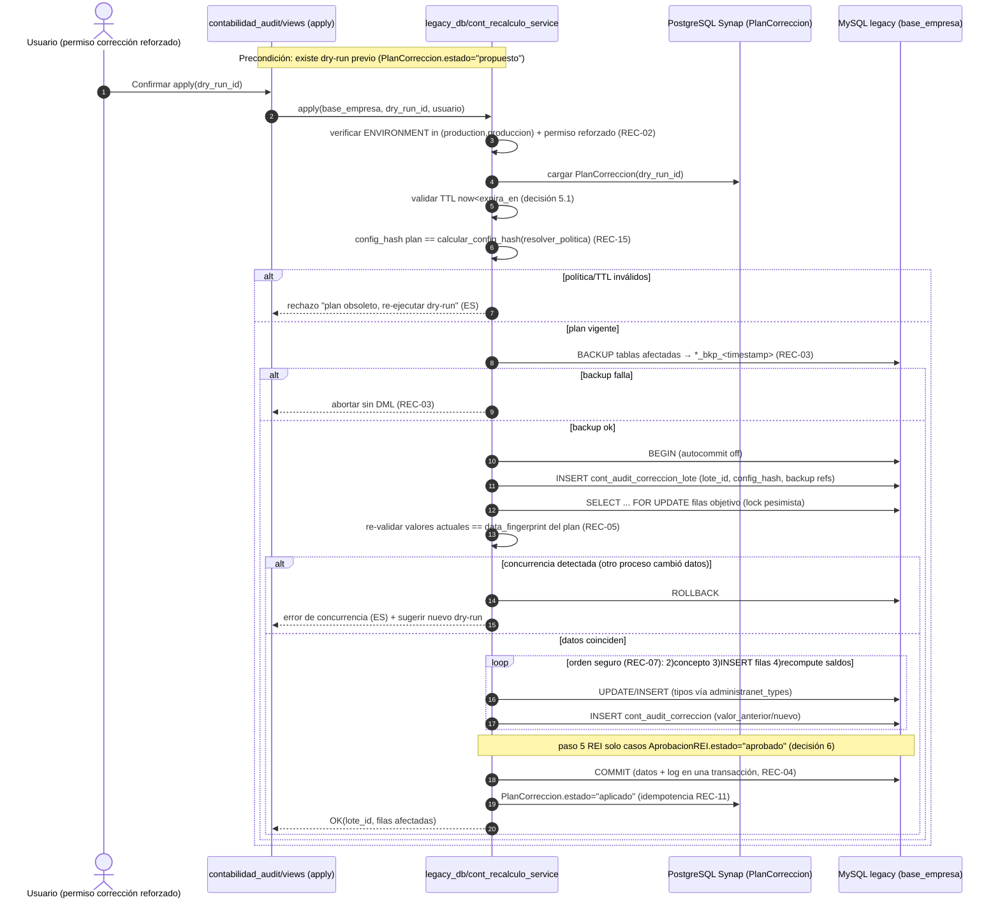
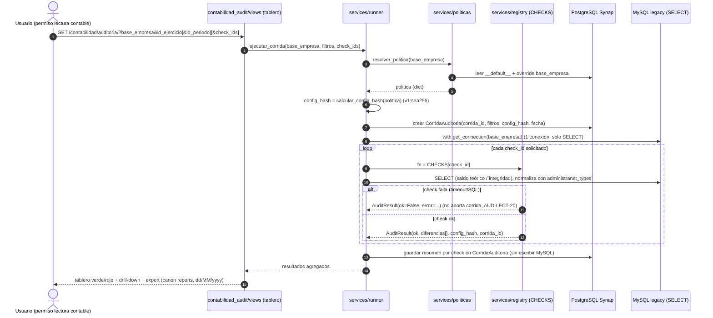

# Design — Auditoría y recálculo de imputación contable

**Cambio:** `contabilidad-auditoria-recalculo`
**Fecha:** 18/07/2026
**Estado:** Propuesto
**Persistencia SDD:** openspec
**Entradas:** [proposal.md](./proposal.md), [exploration.md](./exploration.md), delta specs en `specs/*/spec.md`, `docs/general/PROPUESTA_ARQUITECTURA_AUDITORIA_RECALCULO_CONTABILIDAD_SYNAP.md`, `docs/general/AUDITORIA_IMPUTACION_CONTABILIDAD_VB6.md`

> **Verificación de rutas (repo real).** Antes de citarlas, se confirmó la existencia de:
> `reports/services/reconciliation_saldo_pedido_proveedor.py`, `reports/services/reconciliation_saldo_stock.py`,
> `reports/services/connection_pool.py` (re-export de `core/mysql_pool.py`),
> `legacy_db/services/imputaciones_service.py` (+ `orden_pago_service.py`, `factura_compra_service.py`, `__init__.py`),
> `legacy_db/db_router.py` (`LegacyDbRouter`), `core/utils/administranet_types.py`,
> `core/services/legacy_mysql_schema/catalog.py` (con `PROVIDER_REGISTRY`, `run_provider_by_id`, `run_all_providers`) y `helpers.py`,
> `reports/services/export_service.py`, `reports/dashboard_detail.html`, `reports/urls.py` (`dashboard/<slug:slug>/`),
> `django_project/settings.py` (`ENVIRONMENT`, `DATABASES['mysql']`, `DATABASE_ROUTERS=['legacy_db.db_router.LegacyDbRouter']`, `DEFAULT_BASE_EMPRESA`).
> **`contabilidad_audit/`**: al momento del diseño no existía (app nueva a crear en F1). **Ya fue creada e implementada** (Fases 0-3 + REI); alta en `INSTALLED_APPS` y rutas montadas en `django_project/urls.py`.

---

## 1. Objetivo y alcance del diseño

Diseñar dos motores en fases sobre las tablas `cont_*` del MySQL legacy AdministraNET:

- **Fase 1 (auditoría, solo lectura):** app nueva `contabilidad_audit` con un *registry* de checks deterministas (`SELECT`), políticas por empresa en la DB propia de Synap (PostgreSQL) y tablero canon reportes. **Cero** escritura legacy.
- **Fase 3 (corrección controlada):** servicio en `legacy_db/services/cont_recalculo_service.py` con dry-run → backup → transacción → re-validación de concurrencia → escritura → log, detrás de permiso reforzado y `ENVIRONMENT=production`.

Regla de oro (arquitectura §1): *lectura primero, corrección después*. `cont_asiento` es la **fuente de verdad**; las tablas `cont_*_saldo_cta` son **derivadas reconstruibles**.

---

## 2. Arquitectura por capas y componentes reales

```
┌───────────────────────────────────────────────────────────────────────┐
│ UI canon reportes   /contabilidad/auditoria/  /configuracion/  /rei/    │
│  reports/dashboard_detail.html + reports/includes/ (NO ventas/*)        │
└───────────▲───────────────────────────────────────────┬────────────────┘
            │ read (JSON, F1)                            │ write (F3: permiso+prod+confirm)
┌───────────┴───────────────────────┐      ┌─────────────┴──────────────────────┐
│ AUDIT ENGINE  (read-only, F1/F2)   │      │ CORRECTION ENGINE (F3)              │
│ contabilidad_audit/services/       │      │ legacy_db/services/                 │
│  · registry.py  CHECKS = {...}     │      │   cont_recalculo_service.py         │
│  · checks/*.py  (1 fn por check)   │      │  · dry_run()  (100% SELECT)         │
│  · runner.py    orquestación       │      │  · apply()    (transaccional)       │
│  · politicas.py resolver_politica  │      │  · rollback_lote()                  │
│  · resultados.py AuditResult/Check │      │  reutiliza policy resuelta (arg)    │
└───────────▲───────────────────────┘      └─────────────▲──────────────────────┘
            │ get_mysql_pool()                            │ get_connection(base_empresa)
            │ (SELECT)                                    │ (autocommit off → commit/rollback)
     ┌──────┴─────────────────────────────────────────────┴──────┐
     │              MySQL AdministraNET (legacy, por empresa)      │
     │  cont_asiento · cont_*_saldo_cta · cont_pc · cont_ejercicio │
     │  cont_periodo · cont_concepto_asiento · cont_cc_asiento ... │
     │  + (F3) cont_audit_correccion / _lote  · *_bkp_<timestamp>  │
     └────────────────────────────────────────────────────────────┘

 PostgreSQL Synap (default): PoliticaAuditoriaContable, CorridaAuditoria,
   PlanCorreccion, AprobacionREI  (metadatos F1/F2; nunca datos contables legacy)
```

### 2.1 Mapa de componentes → rutas reales

| Necesidad | Componente | Ruta real (verificada) |
|-----------|-----------|------------------------|
| Conexión MySQL multiempresa | `get_mysql_pool()`, `get_connection()`, `mysql_cursor()` | `core/mysql_pool.py` (re-exportado por `reports/services/connection_pool.py`) |
| Patrón read-only a imitar | `run_reconciliation()`, `get_movimiento_detalle()` | `reports/services/reconciliation_saldo_pedido_proveedor.py` |
| Normalización tipos legacy | `to_int_or_none`, `to_date_or_none`, `to_decimal_or_none`, `str_or_default` | `core/utils/administranet_types.py` |
| Escritura legacy (F3) | nuevo `cont_recalculo_service.py` (junto a `imputaciones_service.py`) | `legacy_db/services/` |
| Router DB legacy | `LegacyDbRouter` | `legacy_db/db_router.py` (`DATABASE_ROUTERS`) |
| DDL legacy centralizado (F3) | nuevo provider en `PROVIDER_REGISTRY` | `core/services/legacy_mysql_schema/catalog.py` |
| Export CSV/Excel | `export_service` | `reports/services/export_service.py` |
| UI canónica | `dashboard_detail.html` + includes; ruta `dashboard/<slug:slug>/` | `reports/dashboard_detail.html`, `reports/urls.py` |
| App nueva F1 | `contabilidad_audit/` (models, services, views, urls, templates, sql) | **a crear**; alta en `INSTALLED_APPS` (`django_project/settings.py`) |

### 2.2 Estructura propuesta de la app nueva

```
contabilidad_audit/
  __init__.py
  apps.py
  models.py                 # PoliticaAuditoriaContable, CorridaAuditoria, PlanCorreccion, AprobacionREI (Postgres)
  admin.py
  migrations/               # SOLO Postgres (default); MySQL legacy nunca se migra por Django
  services/
    __init__.py
    resultados.py           # dataclasses AuditResult, Diferencia, Check (Protocol)
    politicas.py            # resolver_politica(), calcular_config_hash()
    registry.py             # CHECKS = {check_id: fn}
    runner.py               # ejecutar_corrida(base_empresa, filtros, check_ids)
    checks/
      __init__.py
      saldos.py             # saldo_ejercicio_vs_diario, saldo_periodo_vs_diario, cuentas_sin_fila_saldo
      asientos.py           # asiento_balanceado, imputacion_a_no_imputable, nro_asiento_duplicado, codigo_movimiento_huerfano
      conceptos.py          # concepto_anulacion_incoherente, concepto_no_normal
      periodos.py           # fecha_fuera_de_periodo, periodos_solapados
      cierres.py            # cierre_resultado_no_cero, reparto_cc_incompleto
      rei.py                # rei_recalculo
      _sql.py               # consulta canónica de saldo teórico (reusada)
  views.py                  # tablero, configuración, dry-run, aprobación REI
  urls.py                   # /contabilidad/auditoria/...
  templates/contabilidad_audit/  # extienden includes de reports
  sql/                      # DDL runtime del log de corrección (F3), fuente para catalog.py
```

> **Regla de escritura.** El motor de auditoría (F1) importa **solo** `get_mysql_pool`/`mysql_cursor` para `SELECT`. La app `contabilidad_audit` **no** importa `legacy_db.services`. La corrección (F3) vive en `legacy_db/services/cont_recalculo_service.py`; `contabilidad_audit` la invoca desde la vista de apply, nunca al revés.

---

## 3. Fase 1 — Motor de auditoría (solo lectura)

### 3.1 Contrato `Check` / `AuditResult` (interfaz)

`contabilidad_audit/services/resultados.py`:

```python
from __future__ import annotations
from dataclasses import dataclass, field
from decimal import Decimal
from typing import Any, Optional, Protocol

@dataclass
class Diferencia:
    id_pc: Optional[int] = None
    cod_pc: Optional[str] = None
    id_ejercicio: Optional[int] = None
    id_periodo: Optional[int] = None
    codigo_movimiento: Optional[str] = None
    nro_asiento: Optional[int] = None
    valor_esperado: Optional[Decimal] = None
    valor_actual: Optional[Decimal] = None
    delta: Optional[Decimal] = None
    referencia_hallazgo: str = ""        # p.ej. "H04"
    detalle: dict[str, Any] = field(default_factory=dict)  # datos extra de drill-down

@dataclass
class AuditResult:
    check_id: str
    titulo: str
    severidad: str                       # "critico" | "alto" | "medio"
    ok: bool
    total_evaluado: int
    total_diferencias: int
    diferencias: list[Diferencia]
    resumen: dict[str, Any]
    config_hash: str
    corrida_id: str
    fecha_corrida: str                   # dd/MM/yyyy HH:mm (para UI)
    error: Optional[str] = None

class Filtros(Protocol):
    base_empresa: str
    id_ejercicio: int
    id_periodo: Optional[int]
    fecha_desde: Optional[str]
    fecha_hasta: Optional[str]

class Check(Protocol):
    check_id: str
    titulo: str
    severidad: str
    def __call__(self, base_empresa: str, filtros: dict,
                 politica: dict, contexto: "CorridaContexto") -> AuditResult: ...
```

- **Determinismo (AUD-LECT-02):** cada check es una función pura de `(base_empresa, filtros, politica, datos legacy)`. No lee constantes de negocio (las recibe en `politica`), no muta estado global.
- **Aislamiento de errores (AUD-LECT-20):** el `runner` envuelve cada check en `try/except`; un fallo produce `AuditResult(ok=False, error=...)` y **no** aborta la corrida ni enmascara como `ok=True`.
- **Tipos (AUD-LECT-17):** toda lectura pasa por `administranet_types` antes de comparar/serializar. Los `delta` se calculan en `Decimal`.

### 3.2 Registry y runner

```python
# registry.py
CHECKS: dict[str, Check] = {
    "asiento_balanceado": asiento_balanceado,
    "saldo_ejercicio_vs_diario": saldo_ejercicio_vs_diario,
    "saldo_periodo_vs_diario": saldo_periodo_vs_diario,
    "cuentas_sin_fila_saldo": cuentas_sin_fila_saldo,
    "imputacion_a_no_imputable": imputacion_a_no_imputable,
    "concepto_anulacion_incoherente": concepto_anulacion_incoherente,
    "nro_asiento_duplicado": nro_asiento_duplicado,
    "codigo_movimiento_huerfano": codigo_movimiento_huerfano,
    "fecha_fuera_de_periodo": fecha_fuera_de_periodo,
    "periodos_solapados": periodos_solapados,
    "cierre_resultado_no_cero": cierre_resultado_no_cero,
    "reparto_cc_incompleto": reparto_cc_incompleto,
    "rei_recalculo": rei_recalculo,
    "concepto_no_normal": concepto_no_normal,
}
```

El `runner.ejecutar_corrida(base_empresa, filtros, check_ids=None)`:
1. `politica = resolver_politica(base_empresa)` y `config_hash = calcular_config_hash(politica)`.
2. Crea `CorridaAuditoria` (Postgres) con `corrida_id` (UUID), filtros, `config_hash`, `fecha_corrida`.
3. Ejecuta los checks solicitados (todos si `check_ids is None`), reutilizando **una** conexión del pool por corrida (patrón `with get_connection(base_empresa)`), en solo lectura.
4. Agrega resumen por check y persiste conteos en la corrida (Postgres). **No** escribe MySQL.

### 3.3 Consulta canónica de saldo teórico (núcleo)

`checks/_sql.py` centraliza la consulta usada por `saldo_*_vs_diario` (arquitectura §4.3), parametrizada por política:

```sql
SELECT a.id_pc, a.id_ejercicio, a.id_periodo,
       CASE pc.saldo_pc
            WHEN 'Deudor'   THEN SUM(a.debe_asiento  - a.haber_asiento)
            WHEN 'Acreedor' THEN SUM(a.haber_asiento - a.debe_asiento)
            ELSE NULL                         -- saldo_pc NULL/desconocido → diferencia crítica (AUD-LECT-05)
       END AS saldo_teorico
FROM cont_asiento a
JOIN cont_pc pc ON pc.id_pc = a.id_pc
WHERE a.id_ejercicio = %s
  /* {filtro_anulados} inyectado según politica['tratamiento_anulados'} */
GROUP BY a.id_pc, a.id_ejercicio, a.id_periodo;
```

El comparador aplica la regla numérica de §5 (decisión 1) con `tolerancia_decimal` y `politica_centavo`. Las cuentas con `saldo_pc` NULL se reportan como diferencia crítica sin excepción no controlada.

### 3.4 UI (canon reportes)

- Rutas nuevas bajo `contabilidad_audit/urls.py`: `/contabilidad/auditoria/` (tablero verde/rojo por check + filtros empresa/ejercicio/periodo + drill-down), `/contabilidad/auditoria/configuracion/` (políticas), `/contabilidad/auditoria/dry-run/` (F2), `/contabilidad/auditoria/rei/<dry_run_id>/` (aprobación REI).
- Reutiliza `reports/dashboard_detail.html` + `reports/includes/`. Export vía `reports/services/export_service.py`. **Prohibido** usar `ventas/objetivos-venta/` o `ventas/presupuestos/` como referencia visual.
- Fechas en UI dd/MM/yyyy; etiquetas y mensajes en español.

---

## 4. Modelo de datos de configuración (PostgreSQL Synap)

`contabilidad_audit/models.py` (DB `default`, nunca legacy):

```python
class PoliticaAuditoriaContable(models.Model):
    BASE_DEFAULT = "__default__"                    # convención documentada (POL-02)
    base_empresa = models.CharField(max_length=64, unique=True)  # "__default__" = global
    tratamiento_anulados = models.CharField(max_length=32, default="excluir")      # excluir | incluir_neutralizado
    politica_centavo     = models.CharField(max_length=32, default="diario_manda") # diario_manda | conservar_compensacion
    prefijos_cuenta      = models.JSONField(default=dict)  # {resultado:[...], activo:[...], pasivo:[...], pn:[...]}
    ejercicios_cerrados  = models.CharField(max_length=32, default="no_tocar")     # no_tocar | permitir_con_reapertura
    alcance_recompute    = models.CharField(max_length=32, default="ejercicio_seleccionado")
    tolerancia_decimal   = models.DecimalField(max_digits=8, decimal_places=4, default=Decimal("0.005"))
    actualizado_por      = models.CharField(max_length=64)
    actualizado_en       = models.DateTimeField(auto_now=True)

    def clean(self):  # valida enums + JSON de prefijos (ver decisión 3)
        ...

class CorridaAuditoria(models.Model):        # metadatos de cada corrida read-only (F1)
    corrida_id   = models.UUIDField(default=uuid.uuid4, unique=True, editable=False)
    base_empresa = models.CharField(max_length=64)
    filtros      = models.JSONField(default=dict)      # id_ejercicio, id_periodo, check_ids, fechas
    config_hash  = models.CharField(max_length=80)     # "v1:<sha256>"
    resumen      = models.JSONField(default=dict)       # por check: ok/total/diferencias
    ejecutada_por = models.CharField(max_length=64)
    fecha_corrida = models.DateTimeField(default=timezone.now)

class PlanCorreccion(models.Model):          # F2 dry-run → F3 apply (decisión 5)
    dry_run_id   = models.UUIDField(default=uuid.uuid4, unique=True, editable=False)
    base_empresa = models.CharField(max_length=64)
    alcance      = models.JSONField(default=dict)       # id_ejercicio, id_periodo, alcance_recompute
    config_hash  = models.CharField(max_length=80)
    data_fingerprint = models.CharField(max_length=80)  # hash de valores actuales que se modificarían
    plan         = models.JSONField(default=dict)       # items (tabla, clave, valor_anterior, valor_nuevo, delta)
    estado       = models.CharField(max_length=24, default="propuesto")  # propuesto|aplicado|expirado|invalidado
    creado_por   = models.CharField(max_length=64)
    creado_en    = models.DateTimeField(default=timezone.now)
    expira_en    = models.DateTimeField()               # creado_en + PLAN_TTL_MIN

class AprobacionREI(models.Model):           # decisión 6 (caso a caso)
    dry_run_id   = models.UUIDField()
    id_pc        = models.IntegerField()
    id_ejercicio = models.IntegerField()
    rei_teorico  = models.DecimalField(max_digits=18, decimal_places=4)
    rei_actual   = models.DecimalField(max_digits=18, decimal_places=4)
    estado       = models.CharField(max_length=16, default="pendiente")  # pendiente|aprobado|rechazado
    aprobado_por = models.CharField(max_length=64, blank=True)
    aprobado_en  = models.DateTimeField(null=True, blank=True)
```

`resolver_politica(base_empresa) -> dict` (POL-02): carga `__default__`, aplica override campo a campo de la fila específica y devuelve un `dict` completo sin NULL en parámetros obligatorios. Se pasa **explícitamente** a checks y corrección (POL-11).

---

## 5. Puntos abiertos cerrados (decisión + rationale)

### Decisión 1 — Regla numérica `politica_centavo` vs tolerancia

Se separan dos umbrales con roles distintos:

- **`tolerancia_decimal`** (política, default `0.005`): ruido de comparación `Decimal` (redondeo/serialización). Aplica a **todos** los checks de importe.
- **`CENTAVO`** = `Decimal("0.01")` (constante fija en `checks/_sql.py`, no configurable): máximo ajuste que VB6 `Balancea_asiento` aplica legítimamente (±0,01).

Regla de reporte de desbalance/diferencia de saldo:

| `politica_centavo` | Se reporta diferencia si… |
|--------------------|---------------------------|
| `diario_manda` (default) | `abs(delta) > tolerancia_decimal` (el diario manda; hasta el centavo cuenta) |
| `conservar_compensacion` | `abs(delta) > max(tolerancia_decimal, CENTAVO)`; los desbalances `≤ CENTAVO` se listan como **informativos** (`severidad="medio"`, no cuentan en `total_diferencias`, van en `resumen["compensaciones_centavo"]`) |

**Rationale:** `tolerancia_decimal` es tolerancia técnica; `CENTAVO` modela una decisión de negocio (aceptar la compensación histórica de VB6). Fijar `CENTAVO=0.01` como constante evita que se confunda con la tolerancia técnica y refleja exactamente el comportamiento de `Balancea_asiento` (H10). Mantener las compensaciones como informativas preserva trazabilidad sin generar falsos positivos. Cierra AUD-LECT-04 (escenario "balanceado dentro de tolerancia") y POL-04.

### Decisión 2 — Emparejamiento original↔contra-asiento (`incluir_neutralizado`)

Un par de anulación se define formalmente cuando existe un **contra-asiento** C para un **asiento original** O tal que:

1. Mismo `id_ejercicio`.
2. `C.id_concepto_asiento == O.concepto.id_concepto_anul` (concepto de anulación del original, **no** `id_concepto_asiento + 1`; corrige H05).
3. Montos exactamente opuestos por cuenta: para cada `id_pc`, `debe`/`haber` de C invierten los de O dentro de `tolerancia_decimal`.

Semántica por política:

- `excluir` (default): se descartan del saldo teórico O y C (y O marcado `anulado='Si'`).
- `incluir_neutralizado`: O y C **sí** participan del saldo teórico (netean a cero si el par es completo). Un original anulado **sin** contra-asiento válido, o un contra-asiento **huérfano**, se reporta como **neutralización incompleta** (`severidad="alto"`, referencia H05) porque rompe el neteo.

**Rationale:** replica el modelo real de VB6 (conserva ambas filas) y hace explícito el criterio de emparejamiento por concepto de anulación + inversión de montos, que es verificable en `SELECT`. Detecta además el bug de pares rotos. Cierra POL-03 y alimenta `concepto_anulacion_incoherente`.

### Decisión 3 — `prefijos_cuenta` vacíos: validación **y** fallback (defensa en capas)

- **Escritura (validación dura):** `PoliticaAuditoriaContable.clean()` y el form rechazan guardar si `prefijos_cuenta` no es un dict con las 4 claves (`resultado`, `activo`, `pasivo`, `pn`) o si `resultado` está vacío, con mensaje en español. No se persiste JSON inválido.
- **Lectura (fallback defensivo):** si una fila persistida (o migrada) llega con una categoría vacía, `resolver_politica()` rellena esa categoría desde el `__default__` global y registra `logger.warning`; el check dependiente usa el efectivo.
- **Default global sugerido:** `{"resultado": ["4"], "activo": ["1"], "pasivo": ["2"], "pn": ["3"]}` (alineado a VB6; `cierre_resultado_no_cero` usa `cod_pc LIKE '4%'`, editable por empresa; H14).

**Rationale:** validar al escribir evita datos corruptos; el fallback al leer garantiza que la auditoría (read-only, sin riesgo) nunca aborte por config incompleta. Cierra POL-05.

### Decisión 4 — Algoritmo `config_hash`

```python
def calcular_config_hash(politica: dict) -> str:
    campos = ("tratamiento_anulados", "politica_centavo", "prefijos_cuenta",
              "ejercicios_cerrados", "alcance_recompute", "tolerancia_decimal")
    canon = {}
    for k in campos:
        v = politica[k]
        if isinstance(v, dict):                      # prefijos: ordenar listas para orden-insensibilidad
            v = {kk: sorted(map(str, vv)) for kk, vv in sorted(v.items())}
        elif isinstance(v, Decimal):                 # precisión fija
            v = format(v, ".4f")
        canon[k] = v
    payload = json.dumps(canon, sort_keys=True, separators=(",", ":"), ensure_ascii=False)
    return "v1:" + hashlib.sha256(payload.encode("utf-8")).hexdigest()
```

**Convención:** SHA-256 del JSON canónico (claves ordenadas, `Decimal` a string `.4f`, listas de prefijos ordenadas), con prefijo de versión `v1:`. Solo se incluyen los **parámetros de negocio** (no `base_empresa`, `actualizado_*`).

**Rationale:** determinista y estable entre corridas (POL-09); orden-insensible para prefijos evita hashes distintos por reordenar listas; el prefijo `v1:` permite evolucionar el algoritmo sin ambigüedad. Cierra POL-09 y AUD-LECT-18.

### Decisión 5 — TTL y validez del plan dry-run→apply

El `PlanCorreccion` (Postgres) es válido para `apply` solo si se cumplen **las tres** condiciones:

1. **TTL:** `now() < expira_en`, con `PLAN_TTL_MIN = 30` (constante en `cont_recalculo_service.py`).
2. **Config sin cambios:** `config_hash` del plan == `calcular_config_hash(resolver_politica(base_empresa))` actual (REC-15: cambiar política invalida el plan).
3. **Datos sin cambios:** `data_fingerprint` del plan == fingerprint recalculado leyendo los valores actuales de las filas objetivo (SHA-256 sobre `(tabla, clave, valor_actual)` ordenados). Es el guard real de concurrencia.

Al fallar cualquiera, el plan pasa a `estado="expirado"|"invalidado"` y apply se rechaza exigiendo nuevo dry-run (mensaje en español). Tras un apply exitoso, `estado="aplicado"` (consumo único → idempotencia REC-11).

**Rationale:** el `data_fingerprint` protege contra escrituras concurrentes de VB6/Synap entre dry-run y apply; el TTL corto (30 min) acota la ventana aun antes de la re-lectura intra-transacción; el `config_hash` garantiza que las reglas no cambiaron. Tres capas independientes. Cierra REC-01 y REC-15.

### Decisión 6 — Flujo de aprobación REI caso a caso

`rei_recalculo` **nunca** auto-aplica en el `apply` general. Flujo:

1. **Dry-run** genera `propuestas_rei[]` (una por `id_pc`/`id_ejercicio` con `rei_teorico` vs `rei_actual`), persistidas como `AprobacionREI(estado="pendiente")` (Postgres).
2. UI `/contabilidad/auditoria/rei/<dry_run_id>/` lista cada caso; un usuario con **permiso de corrección reforzado + permiso REI** aprueba/rechaza individualmente (`aprobado_por`, `aprobado_en`).
3. Un `apply` en **modo `rei`** procesa **solo** los casos `aprobado`. La corrección **no edita** el asiento REI in-place: **anula** el asiento REI viejo y **genera contra-asiento + nuevo** con acumulación correcta (arquitectura §6.1), en la misma transacción y log que el resto (REC-06).

**Rationale:** el REI tiene implicancia fiscal y matices por cuenta (H02, H44); exige firma humana caso a caso y trazabilidad (`aprobado_por`). Regenerar por contra-asiento (en vez de editar) preserva la partida doble y es reversible. Cierra AUD-LECT-14 y REC-07 (paso 5) / REC-08 (fila REI).

### Decisión 7 — Dónde vive el log/DDL de corrección

Se usan **dos** registros con destinos distintos según la fase:

| Registro | Fase | Motor | Destino | Motivo |
|----------|------|-------|---------|--------|
| `CorridaAuditoria` (+ resumen) | F1/F2 (read-only) | `contabilidad_audit` | **PostgreSQL Synap** (Django model) | F1/F2 no deben escribir **nada** en legacy |
| `cont_audit_correccion` + `cont_audit_correccion_lote` | F3 (apply) | `legacy_db` | **MySQL legacy** (por empresa) | co-localizado con los datos y backups; el INSERT de log va en la **misma transacción** que el UPDATE de datos (atomicidad + rollback por lote REC-04/REC-14) |

DDL del log F3 → **provider nuevo en `catalog.py`** (regla del proyecto: nada de SQL suelto):

```python
# core/services/legacy_mysql_schema/catalog.py
def run_contabilidad_audit_correccion_log_mysql(conn) -> Dict[str, Any]:
    """Crea cont_audit_correccion_lote (cabecera) y cont_audit_correccion (detalle)
    en la base de la empresa. Idempotente (CREATE TABLE IF NOT EXISTS). Solo tablas
    nuevas; NO altera tablas cont_* existentes. Fuente: contabilidad_audit/sql/."""
    ...

PROVIDER_REGISTRY = [
    ...,
    {
        "id": "contabilidad_audit_correccion_log",
        "title": "Contabilidad — log de corrección (cont_audit_correccion)",
        "description": "Crea cont_audit_correccion_lote y cont_audit_correccion "
                       "(trazabilidad de recálculo F3). Tablas nuevas; no toca cont_*.",
        "risk": "bajo",
        "run": run_contabilidad_audit_correccion_log_mysql,
    },
]
```

Campos mínimos (REC-06): `cont_audit_correccion_lote`(`lote_id`, `base_empresa`, `dry_run_id`, `config_hash`, `usuario`, `fecha`, `estado`, `reapertura_flag`, `autorizador`); `cont_audit_correccion`(`id`, `lote_id`, `check_id`, `tabla`, `clave` JSON, `valor_anterior`, `valor_nuevo`, `usuario`, `fecha`). Fechas en UI dd/MM/yyyy.

**Rationale:** separar los dos logs hace estructural la regla de oro: F1 **físicamente incapaz** de tocar legacy (solo Postgres), y el log de F3 comparte transacción y backup con los datos que audita, garantizando rollback consistente por `lote_id`. Registrar el DDL en `catalog.py` cumple `.cursorrules`. Cierra REC-06 y REC-14.

---

## 6. Estrategia de conexión al MySQL legacy multiempresa

- **Fuente única:** `core/mysql_pool.py` (`charset='latin1'`, `sql_mode='STRICT_TRANS_TABLES'`, pool por `host:port:user`, `max_connections=5` configurable en `DATABASES['mysql']['OPTIONS']`).
- **Multiempresa:** el nombre de base se pasa como `database=base_empresa` a `pool.get_connection(base_empresa)`; con conexiones reutilizadas se hace `select_db(base_empresa)` para no leer de otra empresa. `base_empresa` proviene de sesión/filtro; fallback `DEFAULT_BASE_EMPRESA`.
- **Conexión por request:** si `RequestScopedMysqlMiddleware` asignó una conexión (`request_mysql_conn_var`), `get_connection` la reutiliza y no la devuelve al pool.
- **F1 (lectura):** `with get_connection(base_empresa) as conn` → cursor → solo `SELECT`. Una conexión por corrida; sin `commit`. El estado limpio (`rollback()`+`autocommit(True)`) que aplica el pool en cada `get` garantiza ver los últimos datos comprometidos.
- **F3 (escritura transaccional):** `with get_connection(base_empresa) as conn: conn.autocommit(False)`; toda la mutación + INSERT de log en un único `commit()`; cualquier error → `conn.rollback()`. **No** se usa `mysql_cursor` (que hace autocommit por bloque) para el apply, sino control manual de transacción sobre `get_connection`.
- **Concurrencia (REC-05):** `SELECT ... FOR UPDATE` (locking pesimista) sobre contadores/filas objetivo (`nro_asiento_ejercicio`, `codmov`, filas `cont_*_saldo_cta`) dentro de la transacción; re-validación de valores contra el plan antes de escribir.

---

## 7. Secuencia de corrección (F3): dry-run → backup → transacción → re-validación → escritura → log



---

## 8. Secuencia de una corrida de auditoría (F1, read-only)



---

## 9. Decisiones de arquitectura transversales (rationale)

| # | Decisión | Rationale |
|---|----------|-----------|
| A1 | Separar F1 (app `contabilidad_audit`, solo `SELECT`) de F3 (`legacy_db/services`) | Hace estructural la regla de oro; F1 no importa `legacy_db` → incapaz de escribir legacy. Respeta separación app/legacy del proyecto. |
| A2 | Config + corridas de auditoría en **PostgreSQL**, log de corrección en **MySQL legacy** | La política es negocio Synap (no dato AdministraNET); el log de mutación debe ser atómico con los datos que audita. |
| A3 | Check = función pura que recibe `politica` como argumento (sin constantes) | Determinismo, testeabilidad y reproducibilidad vía `config_hash` (POL-11, AUD-LECT-02/18). |
| A4 | Reusar `get_mysql_pool`/`get_connection` y patrón `reconciliation_*` | Un solo camino de conexión multiempresa ya probado; evita duplicar lógica de pool/locale. |
| A5 | `cont_asiento` como fuente de verdad; saldos son derivadas reconstruibles | El recompute maestro (paso 4) resuelve H04/H10/H17/H33/H34 de una vez; el backup cubre reversión. |
| A6 | Control manual de transacción en F3 (`autocommit(False)` + `commit`/`rollback`) en vez de `mysql_cursor` | El apply necesita **una** transacción por lote con log incluido; `mysql_cursor` hace commit por bloque. |
| A7 | DDL del log vía `PROVIDER_REGISTRY` en `catalog.py` | Regla `.cursorrules`: migraciones de esquema legacy siempre en el catálogo central; ejecutable por herramienta global. |
| A8 | Tres guards de validez de plan (TTL + config_hash + data_fingerprint) | Defensa en capas contra concurrencia VB6/Synap y cambios de política entre dry-run y apply. |
| A9 | REI y cierres de resultado **fuera** del auto-apply | Implicancia fiscal; requieren revisión/aprobación humana (REC-08). |

---

## 10. Riesgos arquitectónicos y desviaciones

- **Nombres de columnas `cont_*`:** los checks asumen nombres (`debe_asiento`, `haber_asiento`, `saldo_pc`, `id_concepto_anul`, `cont_*_saldo_cta`, `fecdesde/fechasta` de periodo) tomados de `docs/general/AUDITORIA_IMPUTACION_CONTABILIDAD_VB6.md` y del patrón `reconciliation_*`; **deben confirmarse contra el esquema real por empresa** en `sdd-tasks`/I0 (algunas empresas pueden variar). Mitigación: `_sql.py` centraliza nombres; tests I0 contra base real vía `docker exec Synap_app`.
- **`charset='latin1'` del pool:** el acento/serialización de textos legacy usa latin1; export debe re-codificar. Ya cubierto por `str_or_default` (decodifica bytes) y `export_service`.
- **Desviación de patrón (menor):** F3 usa control manual de transacción en lugar de `mysql_cursor` (A6). Documentado; no rompe el patrón de lectura.
- **`historico` en `alcance_recompute`:** performance; ejecutar por lotes por ejercicio, fuera de horario (POL-07, riesgo del proposal).
- **`SELECT ... FOR UPDATE` sobre MySQL 5.7 legacy compartido con VB6:** posibles esperas de lock; definir `innodb_lock_wait_timeout` acotado y abortar con error de concurrencia claro (decisión de tuning fina para `sdd-tasks`).
- **Permisos Synap dedicados** (lectura vs configuración vs corrección reforzada vs REI): deben crearse en el catálogo de permisos Synap (`synap_permiso*`); no reutilizar permisos VB6. Abierto para `sdd-tasks`.

---

*Listo para **sdd-tasks**. Este diseño es iterable (I0–I5 del proposal §7).*
