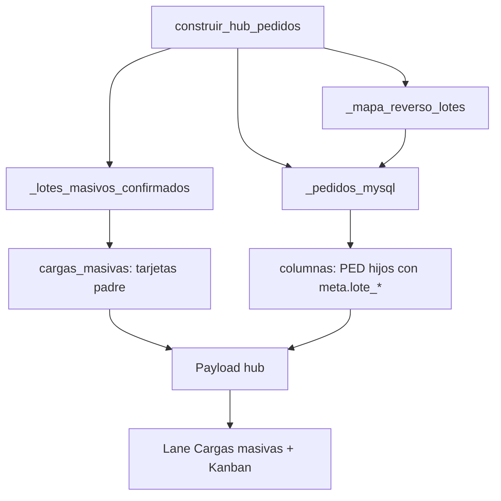
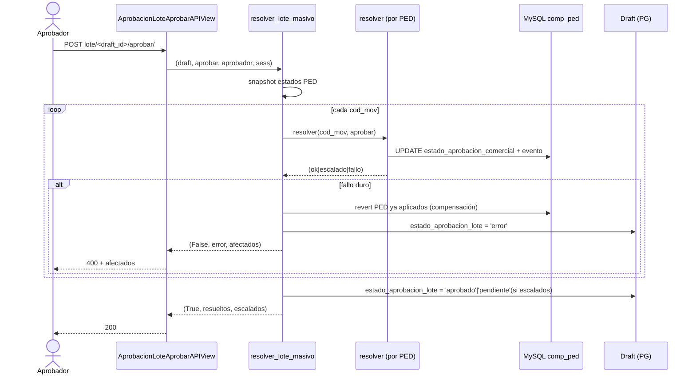

# Design: Hub consolidado de cargas masivas

## Technical Approach

Consolidar cada draft masivo confirmado (`EcomPedidoMasivoDraft.estado=confirmado`,
`codigos_movimiento[]`) como una **tarjeta padre** en un lane propio **Cargas
masivas**, separado de las columnas Kanban de estado, sin quitar los PED hijos
del tablero. Los PED hijos se **etiquetan** vía un mapa reverso
`codigo_movimiento → draft_id` construido en el pipeline. Una **pantalla resumen**
del lote reúne totales, tabla por sucursal y la matriz read-only, y ofrece
**autorización de lote completo** (todo-o-nada lógico) delegando en el `resolver`
existente por cada PED. Todo reutiliza el canon UI reportes/MPR (slate hub
`bg-slate-800`, `mpr/base_mpr.html`) y modales Synap (sin `alert/confirm/prompt`).

Mapea a las 5 fases del proposal: (1) pipeline, (2) UI hub, (3) resumen, (4)
autorización lote, (5) tests+docs. Ver specs `ecom-pedido-masivo-lote-resumen`,
`ecom-pedidos-hub-kanban`, `ecom-aprobacion-pedidos`, `ecom-pedido-masivo-sucursales`.

## Architecture Decisions

### Decisión: Estado comercial del lote — campo en draft vs derivado

**Choice**: Campo persistente `estado_aprobacion_lote` en `EcomPedidoMasivoDraft`
(valores `-` / `pendiente` / `aprobado` / `rechazado` / `error`), **sincronizado
al final de `resolver_lote_masivo`** a partir del agregado de los PED.

**Alternatives considered**: Derivar siempre el badge desde los `estado_aprobacion_comercial`
de los N PED en cada carga del hub (join extra a `comp_ped`).

**Rationale**: El lane necesita un badge rápido sin N lecturas MySQL por tarjeta
padre en cada refresh. El campo es la fuente rápida para el lane/rollup; la
pantalla resumen **reconcilia** contra los PED reales (fuente de verdad operativa)
para detectar drift (PED anulado externamente). Nullable/default seguro → código
previo lo ignora (rollback trivial).

### Decisión: Segmento `cargas_masivas` fuera de `columnas[]`

**Choice**: Nueva clave top-level `cargas_masivas: [...]` en el retorno de
`construir_hub_pedidos`, no una columna Kanban.

**Alternatives considered**: Añadir columna `cargas_masivas` a `COLUMNAS_*`.

**Rationale**: No romper el Kanban de estado ni los tests de columnas; el lane es
transversal. Los PED hijos siguen fluyendo por sus columnas operativas.

### Decisión: Autorización lote = orquestación sobre `resolver` por PED

**Choice**: `resolver_lote_masivo` itera `codigos_movimiento` y llama al `resolver`
existente por PED, con **compensación atómica lógica** (snapshot + revert) ante
fallo parcial. No se reescribe el motor de aprobación.

**Alternatives considered**: Transacción MySQL única multi-PED; UPDATE masivo directo.

**Rationale**: Reutiliza reglas de alcance/jerarquía/escalado y eventos
(`ecom_aprobacion_evento`) ya probados. El patrón de compensación replica
`batch_checkout_masivo`. Escalado (aprobación de supervisor que deja el PED
`pendiente` a la espera de gerente) es un resultado **válido**, no un fallo: solo
excepciones/estados inválidos disparan el revert.

### Decisión: Matriz "Qué se cargó" read-only reutilizando la vista existente

**Choice**: Pestaña que embebe `PedidoMasivoSucursalesView` con
`?draft=<id>&readonly=1`; el flag `readonly` deshabilita edición de celdas,
descuentos y confirmar en el bootstrap/JS.

**Alternatives considered**: Nuevo template de matriz de solo lectura.

**Rationale**: Evita duplicar la matriz; solo añade un modo `readonly` al bootstrap
ya existente (`get_context_data` de `pedido_masivo_views.py`).

## Data Flow

```
Hub load:
  construir_hub_pedidos
    ├─ _lotes_masivos_confirmados(base,id_u) ─→ cargas_masivas[] (tarjeta padre)
    ├─ mapa_reverso {cod_mov → draft_id}
    └─ _pedidos_mysql(...) ──(enriquecer con mapa)──→ meta.lote_* + puede_aprobar=False si lote pendiente
                                   │
                                   ▼
              payload { columnas[], cargas_masivas[], items[], labels }

Resumen lote:
  LoteResumenView/API ─→ draft + reconciliación comp_ped ─→ {lote, sucursales[]}

Autorizar lote:
  AprobacionLoteAprobarAPIView ─→ resolver_lote_masivo ─→ [resolver(cod_mov) x N]
                                              │ fallo ─→ compensar (revert snapshots) + estado_aprobacion_lote='error'
                                              └ ok    ─→ estado_aprobacion_lote='aprobado'|'pendiente'(escalado)
```

## File Changes

| File | Action | Description |
|------|--------|-------------|
| `ecom/models.py` | Modify | `EcomPedidoMasivoDraft.estado_aprobacion_lote` (CharField, choices, default `-`, `db_index`) |
| `ecom/migrations/00XX_estado_aprobacion_lote.py` | Create | Migración add column nullable/default |
| `ecom/services/pedidos_hub_pipeline.py` | Modify | `_lotes_masivos_confirmados`, `_mapa_reverso_lotes`, enriquecer `_pedidos_mysql`, `cargas_masivas` en `construir_hub_pedidos` |
| `ecom/services/aprobacion_pedidos.py` | Modify | `resolver_lote_masivo(base, draft, accion, aprobador, motivo, sess_user)` + compensación; `puede_aprobar_lote` |
| `ecom/services/lote_resumen.py` | Create | `construir_resumen_lote(base, draft_id, sess)` (totales + reconciliación por sucursal) |
| `ecom/pedido_gestion_views.py` | Modify | `LoteResumenView`, `LoteResumenAPIView`, `AprobacionLoteAprobarAPIView`, `AprobacionLoteRechazarAPIView`; `hub_bootstrap.urls` += resumen/lote |
| `ecom/pedido_masivo_views.py` | Modify | Soporte `readonly=1` en bootstrap (deshabilita edición/confirmar) |
| `ecom/urls.py` | Modify | Rutas lote (web + APIs) |
| `ecom/templates/ecom/lote_resumen.html` | Create | Pantalla resumen (canon MPR) + pestañas Resumen / Qué se cargó + modales Synap |
| `ecom/templates/ecom/pedidos_hub.html` | Modify | Lane Cargas masivas (desktop), chip móvil, tarjeta padre, chip hijo, ocultar CTA aprobar/rechazar en hijos de lote pendiente |
| `ecom/tests/test_pedidos_hub_pipeline.py` | Modify | Lote en `cargas_masivas`; PED hijo con `lote_draft_id` |
| `ecom/tests/test_aprobacion_lote.py` | Create | Aprobar/rechazar N PED; fallo parcial compensado |
| `ecom/tests/test_lote_resumen.py` | Create | Ownership 403/404; PED ausente → `Anulada`/`No generada` |
| `docs/ecom/PEDIDOS_HUB_KANBAN.md`, `PEDIDO_MASIVO_SUCURSALES.md`, `JERARQUIA_COMERCIAL_APROBACION.md` | Modify | Lane, resumen, autorización lote |

## Interfaces / Contracts

**Payload hub** (nuevo top-level, junto a `columnas`/`items`):

```python
"cargas_masivas": [
  {"tipo": "lote_masivo", "columna": "cargas_masivas", "titulo": "Carga masiva · {Cliente}",
   "subtitulo": "{n} sucursales · {m} artículos", "fecha": "dd/MM/yyyy",
   "url": "/ecom/mayoristapp/pedidos/lote/<draft_id>/", "id_ref": "lote-<draft_id>",
   "meta": {"draft_id": int, "id_cliente": int, "nombre_cliente": str,
            "n_sucursales": int, "codigos_movimiento": [int],
            "rollup": {"por_autorizar": int, "aprobado": int, "en_curso": int, "anulado": int},
            "estado_aprobacion_lote": "pendiente|aprobado|rechazado|error|-",
            "puede_aprobar_lote": bool}}
]
```

**Meta PED hijo** (añadido en `_pedidos_mysql`):

```python
"lote_draft_id": int|None, "lote_label": "Lote · {Cliente} (k/n)",
"lote_indice": int, "lote_total": int
# si lote pendiente: "puede_aprobar" forzado a False
```

**API resumen** — `GET /ecom/api/mayoristapp/pedidos/lote/<draft_id>/`:

```json
{"ok": true,
 "lote": {"draft_id": 12, "cliente": "ACME", "fecha": "22/07/2026", "n_sucursales": 4,
          "estado_aprobacion_lote": "pendiente", "puede_aprobar_lote": true,
          "totales": {"ped_vivos": 4, "importe": 123456.00}},
 "sucursales": [{"id_cliente_domicilio": 5, "nombre": "Suc Centro", "cod_mov": 9001,
                 "nro": "0001-00009001", "estado_operativo": "en_curso",
                 "estado_comercial": "pendiente", "presente": true,
                 "url": "/ecom/mayoristapp/pedido-masivo-sucursales/?modo=simple&cod_mov=9001"}]}
```

**APIs autorización lote** (permiso `ecom.pedidos.aprobar`, solo si aprobación activa):

```
POST /ecom/api/mayoristapp/aprobacion/lote/<draft_id>/aprobar/     body: {}
POST /ecom/api/mayoristapp/aprobacion/lote/<draft_id>/rechazar/    body: {"motivo": "..."}  # obligatorio
→ {"ok": true, "estado_aprobacion_lote": "aprobado", "resueltos": 4, "escalados": 0}
→ error 400: {"ok": false, "error": "...", "afectados": [cod_mov...]}  # tras compensación
```

Servicio: `resolver_lote_masivo(base, draft, accion, aprobador, motivo, *, sess_user) -> (ok, msg, {estado_aprobacion_lote, resueltos, escalados, afectados})`.

## Testing Strategy

| Layer | What to Test | Approach |
|-------|-------------|----------|
| Unit pipeline | Lote confirmado en `cargas_masivas`; mapa reverso; PED hijo con `lote_draft_id`; sin lote → sin chip | `docker exec Synap_app python manage.py test ecom.tests.test_pedidos_hub_pipeline` |
| Unit aprobación | Aprobar/rechazar N PED; escalado no cuenta como fallo; fallo parcial → revert + `error` | `test_aprobacion_lote` con mock de `resolver` |
| Integration resumen | Ownership 403/404; reconciliación PED ausente → `Anulada`/`No generada` | `test_lote_resumen` |
| UI/E2E (manual) | Lane visible, chip móvil, CTA oculto en hijo pendiente, matriz readonly no editable, modales sin diálogos nativos | Verificación en `/ecom/mayoristapp/pedidos/` |

## Migration / Rollout

Migración Django add-column `estado_aprobacion_lote` (nullable/default `-`, sin
backfill obligatorio). Rollback: ocultar segmento en template + revertir pipeline;
campo nuevo ignorado por código previo. APIs de lote independientes de la aprobación
PED-a-PED, que sigue operativa.

## Diagramas

### Estructura del hub



### Secuencia: autorización de lote (todo-o-nada)



## Open Questions

- [ ] Ventana temporal del mapa reverso: ¿reusar `dias=60` de `_pedidos_mysql` o alcance por `updated_at` del draft confirmado? (preferir alinear a la ventana del hub).
- [ ] Rechazo de lote parcialmente escalado: ¿permitir rechazar aunque haya PED en gerencia, o exigir estado homogéneo? (default: permitir rechazo de todos los `pendiente`).
