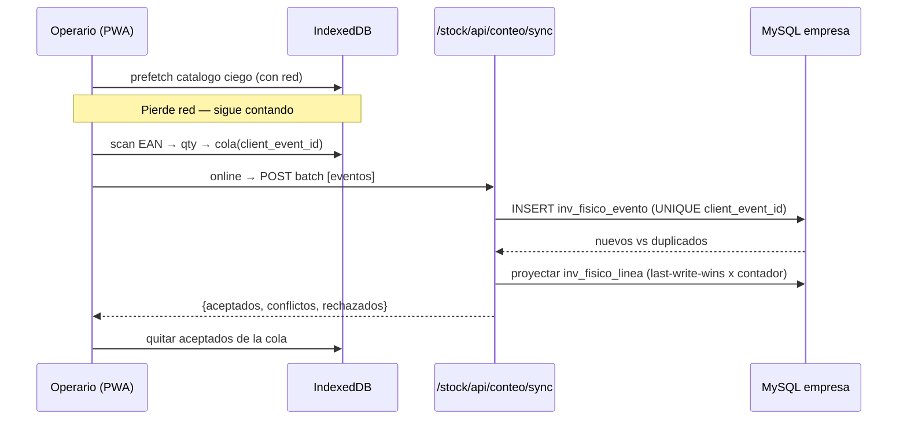
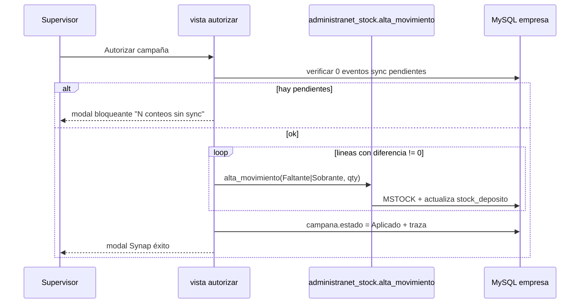

# Design: Inventario físico / Conteo (Stock)

## Enfoque técnico

Migrar `Inventario.frm` a Synap reutilizando patrones existentes: captura→aprobación estilo MPR (`mi-parte`→autorización), escáner `html5-qrcode` de `stock/alta_movimiento.html`, API `articulos-por-codigo`, y posteo con `core/services/administranet_stock.py` (motivos Faltante=3 / Sobrante=4). Datos en MySQL de la empresa (fuente única AdministraNET, como `mpr_*`), DDL vía `core/services/legacy_mysql_schema/catalog.py`. Móvil offline-first con IndexedDB + cola + sync idempotente, extendiendo el SW `theme/static/sw.js` y las whitelists Nivel A. UI escritorio canon reports/MPR; móvil patrón `mpr/mobile/parte_operario.html`. Tipos vía `core.utils.administranet_types`, fechas dd/MM/yyyy, modales Synap (sin alert/confirm/prompt).

## Decisiones de arquitectura (ADRs)

### ADR-1: Esquema nuevo Synap, NO reutilizar `inventario*` legacy
**Elección**: crear 3 tablas nuevas en la base de la empresa: `inv_fisico_campana`, `inv_fisico_linea`, `inv_fisico_evento`.
**Alternativas**: (a) reutilizar `inventario`/`inventario_temp`/`inventario_id`; (b) tablas PostgreSQL Synap.
**Rationale**: evidencia del schema legacy → `inventario_temp` es scratch por usuario (se borra con `DELETE ... WHERE Codusuario=`), `inventario_id` solo guarda rangos de fecha, `inventario` guarda filas finales sin ciclo de vida. Ninguna soporta: estados de campaña, asignación de contadores, `client_event_id` idempotente, estado de sync, ni auditoría de autorización/aplicación MSTOCK. PostgreSQL rompería la fuente única (el stock y MSTOCK viven en MySQL). → esquema nuevo MySQL, idempotente vía catalog.py (`stock/sql/001_inv_fisico_tables.sql`). Compatibilidad: al aplicar, se puede volcar el resultado final a `inventario` como traza legacy (opcional, fase 2).

### ADR-2: Idempotencia y conflictos en `inv_fisico_evento`
**Elección**: ledger append-only de eventos de conteo con `client_event_id` (UUID) UNIQUE; `inv_fisico_linea` es la proyección materializada (última cantidad por artículo×depósito×contador).
**Alternativas**: upsert directo sobre línea sin ledger.
**Rationale**: el ledger permite reintentos sin duplicar (UNIQUE aborta el insert repetido → ACK), auditoría por `client_ts`/`server_ts`, y resolución explícita de conflictos entre contadores (last-write-wins por contador; entre contadores distintos → conflicto reportado, no silencioso).

### ADR-3: Ceguera del contador por contrato de API
**Elección**: `saldo_snapshot` y `diferencia` viven solo en `inv_fisico_linea`/`inv_fisico_campana` y NUNCA se serializan en payloads de prefetch ni de ACK de sync. Serializadores dedicados para el rol contar.
**Rationale**: requisito de negocio (conteo ciego 1A); se blinda con tests de no-filtración.

### ADR-4: Posteo MSTOCK masivo tras autorización
**Elección**: reutilizar `administranet_stock.alta_movimiento` por diferencia≠0 dentro de una transacción, motivo Faltante/Sobrante según signo.
**Alternativas**: SQL directo sobre `stock_deposito`.
**Rationale**: `alta_movimiento` ya maneja talonario MSTOCK, series, actualización de saldo y traza; no duplicar lógica de stock.

## Modelo de datos y estados

`inv_fisico_campana`: `id_campana` PK, `fecha` DATE, `estado`, `depositos` (tipo_mpr Terminado/SemiElaborado/2daSeleccion), `catalogo_version`, `umbral`, `id_usuario_alta`, timestamps.
`inv_fisico_linea`: `id_linea` PK, `id_campana`, `id_articulo`, `id_deposito`, `saldo_snapshot` (privado), `cantidad_contada`, `diferencia` (privado), `id_contador`, `estado_linea`, timestamps.
`inv_fisico_evento`: `id_evento` PK, `client_event_id` UNIQUE, `id_campana`, `id_articulo`, `id_deposito`, `id_contador`, `cantidad`, `client_ts`, `server_ts`, `resultado` (aceptado/conflicto/rechazado), `motivo`.

Estados campaña: `Borrador → EnConteo → EnRevision → Autorizado → Aplicado` (o `Anulado`). Reconteo ciego devuelve a `EnConteo`.

## Flujo offline (contrato)

Con red (1×/campaña): `GET /stock/api/conteo/prefetch/` → catálogo ciego (`id_articulo`, código, nombre, EAN[]) + metadatos (campaña, depósito, `catalogo_version`, hora). Se guarda en IndexedDB.
IndexedDB (`synap_inv_fisico`): store `catalogo` (keyPath `id_articulo`, index por EAN), `cola` (keyPath `client_event_id`), `meta`.
Sin red: scan EAN → resuelve local → qty → escribe en `cola` + UI progreso; banner "N pendientes".
Al reconectar (`online`/Background Sync/botón manual): `POST /stock/api/conteo/sync/` batch ordenado por `client_ts` → respuesta `{aceptados[], conflictos[], rechazados[]}` con motivo en español. UI quita de cola los aceptados. Idempotencia por `client_event_id`.

## Diagramas de secuencia

### Conteo offline → sync

### Autorizar → aplicar MSTOCK

## Seguridad

Permisos: `stock.inventario_fisico.contar` (móvil), `.gestionar` (campañas/analizador), `.autorizar` (aplicar). Decorador `@tiene_permiso`. No-filtración: serializadores del rol contar omiten `saldo_snapshot`/`diferencia`. Whitelist Nivel A: agregar patrones `^/stock/conteo(/.*)?$` en `_MOBILE_ALLOWED` (patterns) y API `^/stock/api/conteo/` en `mobile_level_a_middleware.py`; sumar app en `pwa_nivel_a.py`. Autorizar bloqueado si hay eventos con estado sync pendiente.

## Archivos a crear / modificar

| Archivo | Acción | Descripción |
|---------|--------|-------------|
| `stock/sql/001_inv_fisico_tables.sql` | Crear | DDL 3 tablas (idempotente) |
| `core/services/legacy_mysql_schema/catalog.py` | Modificar | `run_stock_inv_fisico_tables_mysql` + registro en `PROVIDER_REGISTRY` |
| `stock/services/inventario_fisico.py` | Crear | Campañas, snapshot, líneas, prefetch ciego, sync idempotente, analizador, autorizar |
| `stock/views.py` | Modificar | Vistas escritorio (listado, crear, monitor, analizador, autorizar) |
| `stock/mobile_views.py` | Crear | Vistas móviles conteo (mis conteos, depósito, cola) |
| `stock/api_views.py` | Modificar | `api_conteo_prefetch`, `api_conteo_sync`, `api_campana_autorizar` |
| `stock/urls.py` | Modificar | Rutas `/inventario-fisico/`, `/conteo/`, `api/conteo/` |
| `stock/templates/stock/inventario_fisico/*.html` | Crear | Escritorio (canon reports/MPR) |
| `stock/templates/stock/conteo/*.html` | Crear | Móvil (patrón `parte_operario.html`) |
| `theme/static/js/inv_fisico_offline.js` | Crear | IndexedDB + cola + sync + html5-qrcode |
| `theme/static/sw.js` | Modificar | Precache shell conteo Nivel A (mantener `/api/` fuera de cache) |
| `core/middleware/mobile_level_a_middleware.py` | Modificar | Whitelist `/stock/conteo/` + `/stock/api/conteo/` |
| `core/pwa_nivel_a.py` | Modificar | Alta app conteo en menú móvil |
| `stock/tests/test_inv_fisico_*.py` | Crear | Ver estrategia de tests |

## Estrategia de tests (Strict TDD — tests primero)

| Capa | Qué | Cómo (`docker exec Synap_app`) |
|------|-----|------|
| Unit | Idempotencia `client_event_id`; proyección last-write-wins; cálculo diferencia; mapeo Faltante/Sobrante | Django TestCase, servicio con MySQL |
| Unit/Seguridad | **No-filtración**: payload prefetch/sync sin `saldo_snapshot`/`diferencia` | assert claves ausentes |
| Integración | Sync batch `{aceptados,conflictos,rechazados}`; bloqueo autorizar con sync pendiente; autorizar→MSTOCK actualiza `stock_deposito` | pytest-django |
| Integración | Whitelist Nivel A permite `/stock/conteo/` y bloquea rutas fuera | test middleware |

## Migración / rollout

DDL idempotente vía catalog.py (sin migración destructiva). Rollback: deshabilitar URLs/permisos; Borrador/EnConteo → Anular sin MSTOCK; Aplicadas → compensación manual; quitar whitelist PWA.

## Open Questions

- [ ] ¿Volcar resultado final a `inventario` legacy como traza (fase 2)? — decidido: opcional, fuera de MVP.
