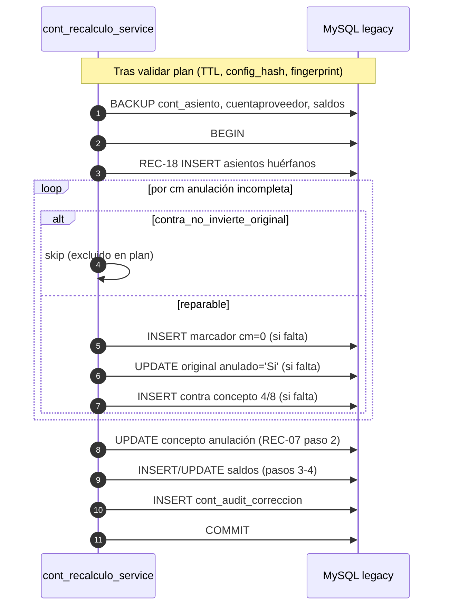

# Design — Apply de anulaciones incompletas (compras/pagos)

**Cambio:** `contabilidad-auditoria-anulaciones-apply`  
**Fecha:** 25/07/2026  
**Estado:** Propuesto  
**Entradas:** [proposal.md](./proposal.md), delta spec REC-19, `docs/general/AUDITORIA_IMPUTACION_CONTABILIDAD_VB6.md` §6.8, `contabilidad_audit/services/checks/compras_pagos.py::integridad_anulacion_compra_pago`

> **Contexto.** REC-18 regenera asientos huérfanos (cm>0 sin filas en `cont_asiento`). Los marcadores `CodigoMovimiento=0` son **parte del mecanismo de anulación**, no huérfanos. Este design añade REC-19: reparar la tripleta incompleta (marcador + original anulado + contra-asiento) detectada por AUD-LECT-23.

---

## 1. Objetivo

Extender `legacy_db/services/cont_recalculo_service.py` para que dry-run y apply reparen automáticamente anulaciones incompletas de compras/pagos, respetando paridad VB6 (`Cont_ProcesosC.frm:2758-2861`) y las salvaguardas existentes (backup, transacción única, fingerprint, permiso producción).

---

## 2. Mapa de problemas → remedios

| Código problema | Condición de detección (check existente) | Acción apply | Tabla |
|-----------------|------------------------------------------|--------------|-------|
| `falta_marcador_cuentaproveedor_cm0` | No existe fila `cuentaproveedor` con `CodigoMovimiento=0` y `codigo_movimiento_anul=cm` | INSERT marcador | `cuentaproveedor` |
| `asiento_original_no_anulado` | Existe asiento con `codigo_movimiento=cm` pero ningún renglón `anulado='Si'` | UPDATE masivo | `cont_asiento` |
| `falta_contra_asiento` | No existe contra con `codigo_movimiento_anul=cm`, concepto IN (4,8), `anulado='No'`, cm≠0 | INSERT renglones contra | `cont_asiento` |
| `contra_no_invierte_original` | Existe contra pero Σdebe/Σhaber no espejan al original (tolerancia) | **Ninguna** — `excluido=True` | — |

Solo se procesan comprobantes con `Anulado='Si'`, `TipoComprobante IN ('FA','FC','OP')`, `CodigoMovimiento>0`, sucursal contable (`sucursales.cont='Si'`).

---

## 3. Decisiones técnicas

### Decisión 1 — Constantes y registro en el motor

```python
CHECK_ANULACION_INTEGRIDAD = "integridad_anulacion_compra_pago"
MARCA_ANULACION_REPAIR = "REGEN auditoria (anulacion incompleta)"
CONCEPTO_ANUL_COMPRA = 4   # FA/FC
CONCEPTO_ANUL_PAGO = 8     # OP
```

- Añadir `CHECK_ANULACION_INTEGRIDAD` a `CHECKS_INCLUIDOS` (después de `CHECK_REGENERACION`, antes de `CHECK_CONCEPTO_ANUL`).
- Añadir `"cuentaproveedor"` a `TABLAS_BACKUP_PERMITIDAS`.
- **No** añadir `contra_no_invierte_original` a `CHECKS_EXCLUIDOS_AUTO_APPLY` global: se excluye **por item** en el plan con `excluido=True` y `motivo_exclusion` en español.

**Rationale:** coherencia con REC-18 (`MARCA_REGEN` dedicada); backup acotado a tablas permitidas; exclusión granular por caso.

### Decisión 2 — Función de planificación `_plan_repair_anulaciones_incompletas`

Nueva función en `cont_recalculo_service.py`:

```python
def _plan_repair_anulaciones_incompletas(
    repo: _RepoLectura,
    ejercicios_alcance: set[int],
) -> list[dict]:
    ...
```

**Algoritmo (100 % SELECT):**

1. Listar originales anulados (misma query base que el check AUD-LECT-23).
2. Por cada `cm`, evaluar los cuatro problemas (reutilizar lógica del check o extraer helper compartido `_evaluar_problemas_anulacion(repo, cm)`).
3. Si `contra_no_invierte_original` ∈ problemas → emitir **un** item resumen `excluido=True` (sin DML propuesto) y **continuar** con el siguiente cm (no mezclar remedios parciales en ese cm).
4. Para problemas reparables, generar items en orden lógico:
   - **a)** INSERT marcador (si falta).
   - **b)** UPDATE original (si no anulado).
   - **c)** INSERT contra-asiento (si falta): clonar renglones del asiento original (`codigo_movimiento=cm`), invertir debe↔haber, asignar concepto 4 u 8 según `TipoComprobante`, reservar `codigo_movimiento` nuevo (lectura contador sin incrementar en dry-run; estimación en plan).

**Campos del marcador INSERT** (paridad §6.8):

| Campo | Valor |
|-------|-------|
| `CodigoMovimiento` | `0` |
| `codigo_movimiento_anul` | cm original |
| `Detalle` | `"Anulacion - {TipoComprobante} - {NroComprobante}"` |
| `Anulado` | `'No'` |
| Demás columnas obligatorias | Copiar del comprobante original (`CodSucursal`, `CodProveedor`, `Fecha`, importes, etc.) vía `administranet_types` |

**Contra-asiento INSERT:**

| Campo | Valor |
|-------|-------|
| `codigo_movimiento` | Nuevo del contador global (`codmov`) — locking en apply |
| `codigo_movimiento_anul` | cm original |
| `id_concepto_asiento` | `4` si FA/FC; `8` si OP |
| `debe_asiento` / `haber_asiento` | Invertidos respecto al renglón original homólogo (`id_pc`) |
| `anulado` | `'No'` |
| `nro_asiento` | Nuevo del contador `cont_ejercicio.nro_asiento_ejercicio` del ejercicio de la fecha |
| `fecha` | `Fecha` del comprobante original (fallback documentado si NULL) |
| `desc_renglon_asiento` | `MARCA_ANULACION_REPAIR` |

**Rationale:** un helper evita divergencia check vs corrección; exclusión total del cm cuando el contra existe pero está mal evita corrupción adicional.

### Decisión 3 — Integración en `dry_run()`

Orden de construcción del plan (items concatenados):

```
items_concepto      = _plan_concepto_anulacion_incoherente(...)   # existente
items_asientos      = _plan_regeneracion_asientos(...)            # REC-18
items_anulacion     = _plan_repair_anulaciones_incompletas(...)   # REC-19 NUEVO
items_saldos        = _plan_reconstruccion_saldos(...)            # REC-17
items = items_concepto + items_asientos + items_anulacion + items_saldos
```

> **Nota:** `items_concepto` permanece al inicio del array por compatibilidad con impacto/reporte; el **orden de apply** (decisión 4) es el que manda en escritura.

Actualizar `_calcular_impacto()` para contar items por `check_id=integridad_anulacion_compra_pago` (totales, excluidos, reparables).

### Decisión 4 — Orden de apply (escritura)

Extender `_orden_apply_items()` y el bloque apply en `apply()`:

```
1. Regeneración asientos huérfanos     (check_id = comprobante_compra_pago_sin_asiento)
2. Reparación anulaciones incompletas  (check_id = integridad_anulacion_compra_pago)
   2a. INSERT marcadores cuentaproveedor
   2b. UPDATE cont_asiento anulado='Si' (original)
   2c. INSERT contra-asiento (por cm, transacción atómica por grupo)
3. Concepto anulación incoherente      (check_id = concepto_anulacion_incoherente)
4. INSERT filas saldo faltantes
5. UPDATE recompute saldos
```

Dentro del paso 2c, por cada `cm`:

- Obtener `codigo_movimiento` nuevo con locking pesimista en contador global.
- Obtener `nro_asiento` nuevo con locking en `cont_ejercicio.nro_asiento_ejercicio`.
- Insertar todos los renglones del contra en una pasada; registrar cada mutación en `cont_audit_correccion`.

**Rationale:** regen huérfanos primero garantiza asiento original existente antes de marcar/anular; reparación antes de concepto evita UPDATE de concepto sobre contra inexistente; saldos al final (REC-07).

### Decisión 5 — Idempotencia

| Operación | Guard idempotente |
|-----------|-------------------|
| INSERT marcador | Skip si ya existe `CodigoMovimiento=0` + `codigo_movimiento_anul=cm` |
| UPDATE original | Skip si todos los renglones del cm ya tienen `anulado='Si'` |
| INSERT contra | Skip si ya existe contra válido (concepto 4/8, cm_anul=original, anulado='No'); si existe contra inválido → item excluido (decisión 2.3) |

Segundo dry-run post-apply DEBE reportar cero items aplicables para esos cm.

### Decisión 6 — Backup y log

- Si el plan incluye items sobre `cuentaproveedor`, el backup pre-transacción DEBE crear `cuentaproveedor_bkp_<timestamp>`.
- Cada INSERT/UPDATE de reparación DEBE loguearse con `check_id=integridad_anulacion_compra_pago`, `tabla`, clave JSON (`codigo_movimiento`, `codigo_movimiento_anul`, ids de fila según aplique).
- Items excluidos (`contra_no_invierte_original`) DEBEN aparecer en el reporte de impacto con contador `anulaciones_bloqueadas_manual`.

### Decisión 7 — Ejercicios cerrados y alcance

- Filtrar comprobantes cuya `Fecha` cae en ejercicio dentro de `ejercicios_alcance` (misma función `_ejercicios_en_alcance` que REC-18).
- Respetar `ejercicios_cerrados=no_tocar`: marcar items del ejercicio cerrado como `excluido` vía `_marcar_exclusiones` existente.

### Decisión 8 — Helper compartido check ↔ corrección (opcional recomendado)

Extraer `_evaluar_problemas_anulacion(cur, cm) -> list[str]` a módulo compartido:

- Opción A (preferida): `contabilidad_audit/services/checks/_anulacion_compra_pago.py` importado por check y por `legacy_db` (legacy_db **solo** importa helper de lectura, no la app de auditoría completa).
- Opción B: duplicar query en `cont_recalculo_service` con comentario de paridad — aceptable si se evita dependencia circular.

**Rationale:** una sola fuente de verdad para códigos `problemas[]` evita drift entre auditoría y corrección.

---

## 4. Secuencia apply (diagrama)



---

## 5. Impacto en tests

| Test | Caso nuevo |
|------|------------|
| `test_cont_recalculo_dry_run` | Plan incluye items repair; excluidos por contra mal invertido |
| `test_cont_recalculo_apply` | Apply repara tripleta incompleta; idempotencia; backup cuentaproveedor |
| `test_cont_recalculo_apply` | Apply bloqueado fuera de producción (sin cambio) |

Fixtures: mock cursor con original anulado sin marcador; sin contra; contra desbalanceado.

---

## 6. Documentación

Actualizar `docs/general/AUDITORIA_IMPUTACION_CONTABILIDAD_SYNAP.md`:

- Sección flujo apply: orden 1→5 con REC-19.
- Tabla problemas/remedios.
- Marca `MARCA_ANULACION_REPAIR`.
- Nota: `contra_no_invierte_original` requiere revisión manual (anular/regenerar contra fuera de auto-apply).

---

## 7. Riesgos residuales

| Riesgo | Mitigación |
|--------|------------|
| Contador `codmov` agotado o bloqueado | Timeout lock + error concurrencia REC-05 |
| Comprobante original sin asiento (huérfano) | REC-18 corre primero; si persiste sin asiento, repair de contra queda vacío y el check sigue rojo → operador revisa |
| Duplicar marcador si VB6 insertó entre dry-run y apply | Re-validación fingerprint + guard idempotente pre-INSERT |

---

*Listo para **sdd-tasks** e implementación en `cont_recalculo_service.py`.*
