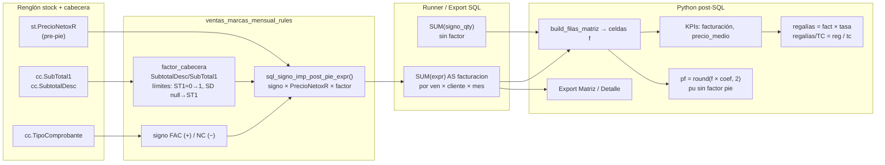

# Design: Descuento al pie en facturación VMM

**Change:** `vmm-dto-pie-facturacion`  
**Capability:** `reports-ventas-marcas-mensual`  
**Estado:** diseño técnico para `sdd-tasks`

---

## 1. Overview del problema y solución

### Problema

El informe **Ventas marcas mensual** (`ventas-marcas-mensual`) agrega facturación con `SUM(signo × stock.PrecioNetoxR)`. En AdministraNET, `PrecioNetoxR` es **pre-pie**: el descuento al pie vive en cabecera (`cuentacliente.SubTotal1`, `SubtotalDesc`, derivado de `PorDesc1`/`ImpDesc1`). La base imponible correcta para facturación, KPIs, regalías, proyección `$` y export es el neto **post-pie**, repartido proporcionalmente por línea con factor `SubtotalDesc / SubTotal1`.

DABRA ya validó este criterio en Python (`factor_descuento_cabecera`) y en materialización de importes (`cant × precio_neto_u × factor_desc`).

### Solución

1. **Extraer** la lógica de factor de cabecera a un módulo compartido (`comprobante_descuento_cabecera.py`) con helper Python y expresión SQL reutilizable.
2. **Introducir** `sql_signo_imp_post_pie_expr()` en `ventas_marcas_mensual_rules.py` que compone signo FAC/NC × `PrecioNetoxR` × factor cabecera.
3. **Sustituir** en VMM (runner + export) todas las referencias a `sql_signo_imp_expr()` / `_signo_imp_sql()` por la variante post-pie.
4. **Dejar intactos** KPIs Python (`_compute_kpis_licencia`, proyección `pf`): recalculan sobre `facturacion` ya corregida en SQL.
5. **No mutar** `sql_signo_imp_expr()` — otros informes (p. ej. licenciatarios) siguen usando la expresión pre-pie.

---

## 2. Flujo de importe (stock → factor → SUM → KPIs)



**Invariante:** solo importes monetarios llevan `factor_cabecera`; unidades (`sql_signo_qty_expr`, factor docenas) no se multiplican.

---

## 3. Architecture Decision Records (ADRs)

### ADR-1: Extraer helper a `comprobante_descuento_cabecera.py`

| Opción | Tradeoff | Decisión |
|--------|----------|----------|
| Duplicar factor en VMM | Rápido pero diverge de DABRA | **Rechazada** |
| Mover a módulo compartido | Un test suite, paridad garantizada | **Elegida** |
| Dejar en DABRA e importar VMM→DABRA | Acopla VMM a informe cliente | **Rechazada** |

**Contenido del módulo nuevo:**

```python
# reports/services/comprobante_descuento_cabecera.py
def factor_descuento_cabecera(subtotal1, subtotal_desc) -> Decimal: ...
def porcentaje_descuento_cabecera(subtotal1, subtotal_desc) -> Decimal: ...
def sql_factor_descuento_cabecera_expr(
    subtotal1_col: str = "cc.SubTotal1",
    subtotal_desc_col: str = "cc.SubtotalDesc",
) -> str: ...
```

- `factor_descuento_cabecera` y `porcentaje_descuento_cabecera` se **mueven** desde `dabra_consolidado_remitos.py` sin cambio de semántica.
- `dabra_consolidado_remitos.py` **re-importa y re-exporta** los símbolos para no romper `from reports.services.dabra_consolidado_remitos import factor_descuento_cabecera`.
- Normalización Python con `to_decimal_or_none` / `_dec` (mismo patrón DABRA).

---

### ADR-2: Nueva `sql_signo_imp_post_pie_expr()` (no mutar la expr vieja)

| Opción | Tradeoff | Decisión |
|--------|----------|----------|
| Modificar `sql_signo_imp_expr()` | Rompe licenciatarios y tests ajenos | **Rechazada** |
| Parámetro `post_pie=True` en la misma función | API ambigua, call sites fáciles de confundir | **Rechazada** |
| Función nueva + sustituir solo call sites VMM | Cambio acotado, regresión controlada | **Elegida** |

**Implementación en `ventas_marcas_mensual_rules.py`:**

```python
def sql_signo_imp_post_pie_expr() -> str:
    fac, nc = ...  # mismos TIPOS_FAC / TIPOS_NC
    factor = sql_factor_descuento_cabecera_expr()  # import desde módulo compartido
    return f"""
        CASE
            WHEN cc.TipoComprobante IN ({fac}) THEN
                COALESCE(st.PrecioNetoxR, 0) * ({factor})
            WHEN cc.TipoComprobante IN ({nc}) THEN
                -COALESCE(st.PrecioNetoxR, 0) * ({factor})
            ELSE 0
        END
    """
```

**Call sites a migrar (solo VMM):**

- `ventas_marcas_mensual_runner.py` línea ~700: `signo_imp = sql_signo_imp_post_pie_expr()`
- `ventas_marcas_mensual_export.py`: eliminar `_signo_imp_sql()` duplicado; importar `sql_signo_imp_post_pie_expr`

**Fuera de alcance:** `ventas_mensuales_licenciatarios_query.py`, `test_ventas_mensuales_licenciatarios.py` — siguen con `sql_signo_imp_expr()`.

---

### ADR-3: Factor SQL con epsilon; SubTotal1=0 → 1; SubtotalDesc null → SubTotal1

| Caso | Python (actual DABRA) | SQL (nuevo) |
|------|----------------------|-------------|
| `SubTotal1` nulo o 0 | factor = 1 | `ABS(COALESCE(SubTotal1,0)) < ε` → 1 |
| `SubtotalDesc` nulo | factor = 1 (usa SubTotal1) | `COALESCE(SubtotalDesc, SubTotal1)` |
| Sin dto pie (SD ≈ ST1) | factor ≈ 1 | mismo ratio |
| Dto 20 % (1000→800) | 0,8 | `800/1000` |

**Expresión SQL propuesta** (`sql_factor_descuento_cabecera_expr`):

```sql
CASE
    WHEN ABS(COALESCE({subtotal1_col}, 0)) < 0.0001 THEN 1
    ELSE COALESCE({subtotal_desc_col}, {subtotal1_col}) / {subtotal1_col}
END
```

- **ε = 0.0001:** evita división por cero en MySQL cuando `SubTotal1` es 0 o residual; alineado con tolerancias DABRA (`calcular_tolerancia`).
- Paridad Python/SQL verificada en tests unitarios del helper y en assert de la cadena SQL generada.

---

### ADR-4: Filtro marca parcial — factor cabecera completo por línea (aceptado)

| Opción | Tradeoff | Decisión |
|--------|----------|----------|
| Repartir dto solo sobre líneas filtradas | Σ filtradas × factor ≠ SubtotalDesc cabecera | **Rechazada** |
| Factor del FA completo × cada línea visible | Con filtro parcial, Σ puede ≠ SubtotalDesc del subset | **Elegida (paridad AdministraNET / DABRA)** |
| Subconsulta prorrateo por marca | Complejidad SQL alta, sin precedente VB6 | **Rechazada** |

**Rationale:** REQ-VMM-PIE-03 exige factor por `CodigoMovimiento` completo. AdministraNET aplica el pie sobre el total del comprobante; al filtrar por marca, cada renglón elegible recibe el mismo factor de cabecera. Documentar en `docs/reports/SPEC_INFORME_VENTAS_MARCAS_MENSUAL.md` y `MAPEO_PUW_PUM_ADMINISTRANET.md`.

---

## 4. Cambios por archivo

| Archivo | Acción | Descripción |
|---------|--------|-------------|
| `reports/services/comprobante_descuento_cabecera.py` | **Crear** | `factor_descuento_cabecera`, `porcentaje_descuento_cabecera`, `sql_factor_descuento_cabecera_expr` |
| `reports/services/dabra_consolidado_remitos.py` | **Modificar** | Eliminar defs locales; import + re-export desde módulo compartido; sin cambio funcional |
| `reports/services/ventas_marcas_mensual_rules.py` | **Modificar** | Añadir `sql_signo_imp_post_pie_expr()`; mantener `sql_signo_imp_expr()` intacta |
| `reports/services/ventas_marcas_mensual_runner.py` | **Modificar** | Import y uso de `sql_signo_imp_post_pie_expr` en matriz única y comparar |
| `reports/services/ventas_marcas_mensual_export.py` | **Modificar** | Reemplazar `_signo_imp_sql()` por import compartido post-pie |
| `reports/tests/test_comprobante_descuento_cabecera.py` | **Crear** | Unit tests factor Python + snapshot SQL expr |
| `reports/tests/test_ventas_marcas_mensual.py` | **Modificar** | Escenarios FA pie 20 %, NC signo, regresión sin pie, paridad export |
| `reports/tests/test_dabra_consolidado_remitos.py` | **Sin cambio funcional** | Debe seguir verde vía re-export |
| `docs/reports/SPEC_INFORME_VENTAS_MARCAS_MENSUAL.md` | **Modificar** | § motor importe post-pie, KPIs, filtro marca parcial |
| `docs/reports/MAPEO_PUW_PUM_ADMINISTRANET.md` | **Modificar** | Nota factor cabecera compartido VMM/DABRA |
| `docs/reports/MANUAL_USUARIO_REPORTES.md` | **Modificar** | Una frase: facturación incluye dto al pie |

---

## 5. Plan de tests

Ejecutar en contenedor Synap:

```bash
docker exec Synap_app python manage.py test \
  reports.tests.test_comprobante_descuento_cabecera \
  reports.tests.test_ventas_marcas_mensual \
  reports.tests.test_dabra_consolidado_remitos
```

| Capa | Qué probar | Enfoque |
|------|------------|---------|
| **Unit — helper** | factor 1 (sin pie), 0,8 (20 %), `SubTotal1=0`, `SubtotalDesc` null | `SimpleTestCase` en módulo nuevo; casos espejo de `test_dabra_consolidado_remitos` |
| **Unit — SQL expr** | Cadena generada contiene `CASE`, ε, `COALESCE(SubtotalDesc` | Assert substring en `sql_factor_descuento_cabecera_expr` y `sql_signo_imp_post_pie_expr` |
| **Unit — reglas VMM** | `sql_signo_imp_expr()` sin factor (no regresión) | Test que la expr vieja no incluye `SubTotal1` |
| **Integración — runner** | Mock cursor: FA `SubTotal1=1000`, `SubtotalDesc=800`, Σ `PrecioNetoxR`=1000 → `facturacion=800` | Patch pool; verificar SQL emitido o filas agregadas |
| **Integración — NC** | Mismo factor, signo negativo → −800 | Idem |
| **Integración — export** | `fetch_detalle_renglones` suma montos = KPI facturación | Mock con mismos datos |
| **Regresión DABRA** | Suite completa sin cambio de salida | Re-export preserva imports |
| **Regresión sin pie** | `SubtotalDesc` ≈ `SubTotal1` → factor 1, paridad con comportamiento previo | Fixture sin `PorDesc1` |

**Tolerancia numérica:** `assertAlmostEqual(..., places=2)` en importes; coherente con redondeo DABRA.

---

## 6. Riesgos y rollback

| Riesgo | Prob. | Mitigación |
|--------|-------|------------|
| Filtro marca parcial vs factor cabecera total | Media | ADR-4 documentado; aceptado por producto |
| Σ líneas × factor ≠ `SubtotalDesc` por redondeo | Baja | Mismo criterio DABRA; tolerancia en tests |
| Regresión DABRA al mover helper | Baja | Re-export; suite DABRA en CI local |
| Export duplicaba expr — divergencia matriz/detalle | Media | Unificar import post-pie; test paridad |
| Licenciatarios accidentalmente post-pie | Baja | No tocar `sql_signo_imp_expr`; grep en review |

**Rollback:** revertir commit del change. Sin migraciones DB. Restaurar `sql_signo_imp_expr()` en runner/export y eliminar módulo compartido si se revierte todo el paquete.

---

## 7. Orden de implementación sugerido (`sdd-tasks`)

1. **T1 — Módulo compartido:** crear `comprobante_descuento_cabecera.py` + tests unitarios helper/SQL.
2. **T2 — Refactor DABRA:** mover imports; verificar `test_dabra_consolidado_remitos` verde.
3. **T3 — Expr post-pie:** añadir `sql_signo_imp_post_pie_expr()` en rules; test expr no rompe expr vieja.
4. **T4 — Runner VMM:** sustituir call site matriz + comparar; test integrado FA pie 20 %.
5. **T5 — Export VMM:** reemplazar `_signo_imp_sql()`; test paridad detalle vs KPI.
6. **T6 — Regresión sin pie + NC signo:** ampliar tests VMM.
7. **T7 — Documentación:** SPEC, MAPEO, MANUAL_USUARIO.

**Dependencias:** T2→T1; T4/T5→T3; T7→T4/T5.

---

## Interfaces / contratos

```python
# Python — paridad DABRA
factor_descuento_cabecera(subtotal1: Any, subtotal_desc: Any) -> Decimal
# Pre: normaliza con to_decimal_or_none
# Post: SubTotal1==0 → Decimal("1"); SubtotalDesc is None → factor 1

# SQL — factor escalar por fila (alias cc disponible en JOIN VMM)
sql_factor_descuento_cabecera_expr(
    subtotal1_col: str = "cc.SubTotal1",
    subtotal_desc_col: str = "cc.SubtotalDesc",
) -> str

# SQL — importe renglón VMM
sql_signo_imp_post_pie_expr() -> str
# Post: equivalente a signo × PrecioNetoxR × sql_factor_descuento_cabecera_expr()
```

**KPIs (sin cambio de firma):** `_compute_kpis_licencia(kpis_base, tasa, tc)` recibe `facturacion` ya post-pie desde SQL; `regalias = fact × tasa`; `precio_medio = fact / unidades`.

**Proyección:** `round_proy_facturacion(f, coef)` sobre `f` post-pie; `ceil_proy_unidades` sin factor.

---

## Open Questions

- Ninguna bloqueante. ε=0.0001 fijado por ADR-3; revisable si QA reporta FAs con `SubTotal1` residual distinto de cero.
