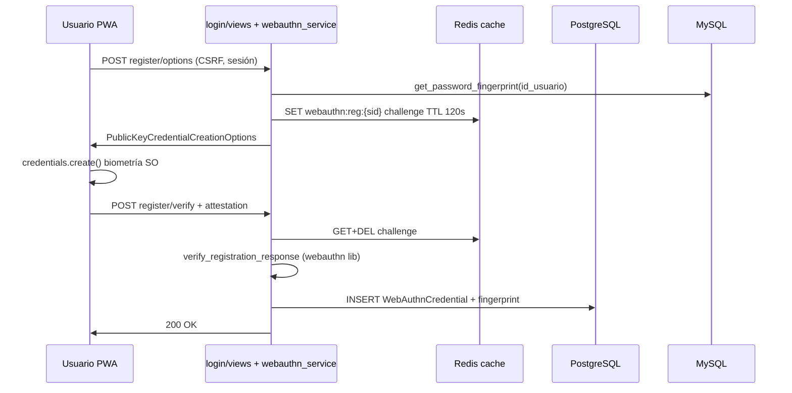
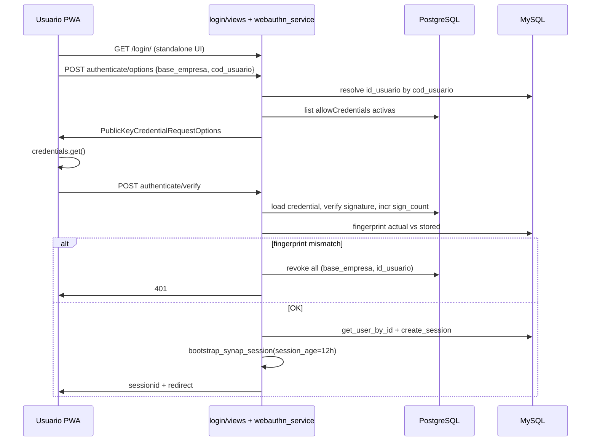

# Design: Acceso rápido PWA con WebAuthn (desbloqueo post-login)

## Technical Approach

Dos fases encadenadas sobre la stack existente (Django 4.2, Postgres Synap, MySQL AdministraNET, Redis cache, PWA Nivel A):

- **Fase 0:** Completar instalabilidad PWA en login móvil (`login/templates/login/mobile/login_administranet.html`): iconos PNG en `theme/static/img/pwa/`, partial PWA reutilizable, paridad con `base_app.html`.
- **Fase 1:** Credenciales WebAuthn en Postgres (`login/models.py`), API bajo `/login/api/webauthn/`, librería `webauthn` (PyPI), unlock solo en PWA standalone con re-selección de empresa; sesión post-unlock con TTL propio vía `request.session.set_expiry()`.

Flujo de sesión reutiliza `AdministraNETAuth.create_session()` y la lógica post-login extraída de `login/views.py` (líneas 87–131) a un servicio compartido.

## Architecture Decisions

| # | Tema | Alternativas | Decisión | Rationale |
|---|------|--------------|----------|-----------|
| 1 | TTL post-unlock | Reutilizar `SESSION_COOKIE_AGE` (default Django **14 días**, no definido en settings) | **`WEBAUTHN_SESSION_AGE = 12 * 3600` (12 h)** | Móvil compartido + unlock sin password; 12 h alinea spec/propuesta y es más estricto que desktop; login con password mantiene expiry por defecto |
| 2 | Detección cambio password | Nueva columna MySQL; hash de password en claro | **`password_fingerprint = SHA-256(hex)` del BLOB `password_usuario`** (columna AES cifrada) | Sin ALTER legacy; al cambiar password cambia el BLOB; se guarda en enroll y se revalida en unlock/login |
| 3 | RP ID / origins | RP ID = dominio completo con path | **RP ID = hostname** (`urlparse(SITE_URL).hostname`); **origin = `SITE_URL` sin slash final** | Requisito WebAuthn; por `ENVIRONMENT`: **dev** `localhost` (+ IP LAN vía `.env` si HTTPS); **staging/prod** hostname de `SITE_URL` / `synap.administranet.com.ar`; añadir a `CSRF_TRUSTED_ORIGINS` |
| 4 | Iconos PWA | Iconos genéricos; solo MEDIA runtime | **Comando `manage.py generate_pwa_icons`** → `theme/static/img/pwa/` | Fuente: (1) logo más reciente `Logo_Signo_administraNET*` en `MEDIA/empresas/logos` (misma lógica que `get_administranet_logo`); (2) fallback `theme/static/img/brand/logo_signo_administranet.png`; Pillow genera 72–512 px; 192/512 con padding maskable 80 % |
| 5 | Standalone | Cookie `display-mode`; solo User-Agent | **JS:** `matchMedia('(display-mode: standalone)').matches \|\| navigator.standalone === true` | Spec; servidor no confía solo en UA; APIs aceptan unlock anónimo pero UI unlock se renderiza solo si flag JS + feature global ON (`login.webauthn.unlock_enabled`) |
| 6 | Librería servidor | `py_webauthn`, implementación manual | **`webauthn>=2.0,<3`** en `requirements.txt` | Mantenida, API FIDO2 completa; `generate_*_options` + `verify_*_response` |
| 7 | Modelo Postgres | JSONField único; tabla por empresa | **`WebAuthnCredential`** + **`WebAuthnUserPreference`** en `login/models.py` | Credenciales + preferencia por `(base_empresa, id_usuario)`; máx. 3 activas enforced en servicio |
| 8 | APIs | Un endpoint monolítico | **7 rutas JSON** bajo `/login/api/webauthn/` | Ver Interfaces; CSRF en POST; challenges Redis TTL 120 s, single-use; rate limit `check_rate_limit` (auth verify: 40/300 s, misma política login); allowlist middleware prefix `/login/api/webauthn/` |
| 9 | Sesión sin password | Duplicar bloque login_view | **`login/services/session_bootstrap.py`:** `bootstrap_synap_session(request, user_data, base_empresa, *, session_age=None)` + **`AdministraNETAuth.get_user_by_id(id_usuario, base_empresa)`** | Paridad hooks (mayoristapp, synap_permisos, MPR); unlock llama con `session_age=settings.WEBAUTHN_SESSION_AGE` |
| 10 | Feature flag | Kill switch por env only | **`SystemConfiguration` clave `login.webauthn.unlock_enabled`** + UI Settings «Acceso rápido PWA»; preferencia usuario en `WebAuthnUserPreference` | Flag global off: APIs 404; preferencia off: register/authenticate 403; passkeys conservadas |

## Data Flow

### Enrollment (post-login, sesión activa)



### Unlock (sin sesión, PWA standalone)



**user_handle:** bytes UTF-8 de `"{base_empresa}:{id_usuario}"`.

## File Changes

| File | Action | Description |
|------|--------|-------------|
| `theme/static/img/pwa/icon-*.png` | Create | PNG generados por comando |
| `theme/static/img/brand/logo_signo_administranet.png` | Create | Fallback marca si no hay MEDIA |
| `login/management/commands/generate_pwa_icons.py` | Create | Pipeline Pillow desde logo producto |
| `login/templates/login/includes/pwa_head.html` | Create | manifest, meta, apple-touch-icon |
| `login/templates/login/includes/pwa_sw_register.html` | Create | Registro SW (paridad base_app) |
| `login/templates/login/mobile/login_administranet.html` | Modify | Includes PWA + UI unlock/enroll (Alpine/JS) |
| `login/templates/login/mobile/perfil.html` | Modify | Listado/revocación passkeys |
| `login/static/login/pwa-standalone.js` | Create | `isPwaStandalone()` |
| `login/static/login/webauthn-client.js` | Create | Fetch options/verify + CSRF |
| `login/models.py` | Modify | Modelo `WebAuthnCredential` |
| `login/migrations/0001_webauthn_credential.py` | Create | Migración Postgres |
| `login/services/webauthn_service.py` | Create | Options, verify, revoke, fingerprint |
| `login/services/session_bootstrap.py` | Create | Extracción post-login de `login_view` |
| `login/administranet_auth.py` | Modify | `get_user_by_id`, `get_password_fingerprint` |
| `login/views.py` | Modify | Refactor bootstrap; delegar WebAuthn views |
| `login/webauthn_views.py` | Create | 6 endpoints API |
| `login/urls.py` | Modify | Rutas `/api/webauthn/...` |
| `django_project/settings.py` | Modify | `WEBAUTHN_*`, documentar RP por env |
| `requirements.txt` | Modify | `webauthn>=2.0,<3` |
| `core/middleware/mobile_level_a_middleware.py` | Modify | Allowlist `/login/api/webauthn/` |
| `core/tests/test_pwa.py` | Modify | CA login móvil manifest/SW |
| `login/tests/test_webauthn.py` | Create | Unit + integración mock webauthn |
| `docs/login/WEBAUTHN_UNLOCK.md` | Create | Operación, RP ID, revocación |
| `docs/general/PWA_SYNAP.md` | Modify | Fase 0 iconos + comando |

## Interfaces / Contracts

### Settings

```python
WEBAUTHN_UNLOCK_ENABLED = config('WEBAUTHN_UNLOCK_ENABLED', default=False, cast=bool)
WEBAUTHN_RP_NAME = 'Synap'
WEBAUTHN_RP_ID = config('WEBAUTHN_RP_ID', default=_hostname_from_site_url)
WEBAUTHN_ORIGIN = config('WEBAUTHN_ORIGIN', default=_site_url_origin)
WEBAUTHN_SESSION_AGE = config('WEBAUTHN_SESSION_AGE', default=12 * 3600, cast=int)
WEBAUTHN_MAX_CREDENTIALS = 3
WEBAUTHN_CHALLENGE_TTL = 120
```

### API (JSON, español en errores)

| Método | Ruta | Auth | Body clave |
|--------|------|------|------------|
| POST | `/login/api/webauthn/register/options/` | Sesión + flag + standalone | `{device_label?}` |
| POST | `/login/api/webauthn/register/verify/` | Sesión | attestation JSON |
| POST | `/login/api/webauthn/authenticate/options/` | Anónimo + flag | `{base_empresa, cod_usuario}` |
| POST | `/login/api/webauthn/authenticate/verify/` | Anónimo | assertion JSON |
| GET | `/login/api/webauthn/credentials/` | Sesión | — |
| POST | `/login/api/webauthn/credentials/revoke/` | Sesión | `{credential_id}` o `{all: true}` |

Flag desactivado → **404** en todas. Register exige `request.session["user"]` coherente con `(base_empresa, id_usuario)` de la sesión.

### Comando iconos

```bash
docker exec Synap_app python manage.py generate_pwa_icons [--source /path/logo.png]
```

## Testing Strategy

| Layer | Qué | Cómo |
|-------|-----|------|
| Unit | Fingerprint, límite 3 credenciales, revoke | `login/tests/test_webauthn.py` + mocks |
| Integration | Options/verify con `webauthn` test vectors | `@override_settings(WEBAUTHN_UNLOCK_ENABLED=True)` |
| PWA | Login móvil manifest/SW | Extender `core/tests/test_pwa.py` |
| E2E manual | Android Chrome + iOS Safari standalone | Checklist docs |

## Migration / Rollout

1. **Fase 0:** `generate_pwa_icons` + partial PWA en login → deploy sin WebAuthn.
2. **Fase 1:** Migración Postgres + `WEBAUTHN_UNLOCK_ENABLED=false` en prod → smoke → activar flag en staging.
3. Rollback Fase 1: flag off; Fase 0: revert static/templates.

## Open Questions

- [ ] Confirmar `SITE_URL` HTTPS en dev LAN (WebAuthn exige secure context salvo `localhost`).
- [ ] Etiqueta UI perfil passkeys: reutilizar patrón toggle sucursales o lista MPR (canon UI en apply).
