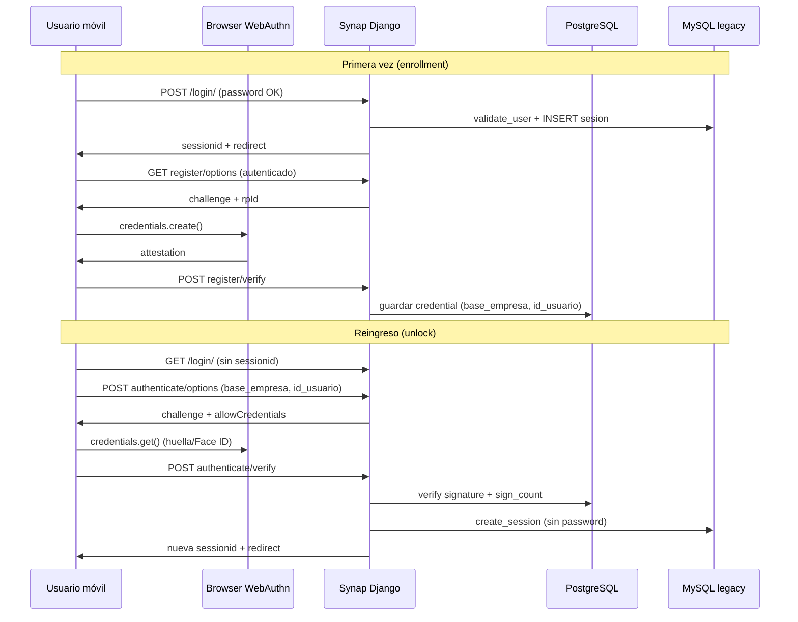

## Exploration: Acceso rápido PWA vía WebAuthn (desbloqueo post-login)

### Current State

**Autenticación actual**

- Login en `login/views.py` + `login/administranet_auth.py`: POST JSON con `cod_usuario`, `password`, `base_empresa`; validación contra MySQL legacy (AES password); creación de fila en tabla `sesion` (AdministraNET) y población de `request.session["user"]` con `id_usuario`, `base_empresa`, etc.
- `request.user` se construye en `core/middleware/base_middleware.py` desde `session["user"]` (`AdministraNETUser` mock).
- Logout en `login/views.py` cierra sesión MySQL, hace `session.flush()` y borra cookies `sessionid` + `csrftoken`.
- No existe WebAuthn, passkeys ni almacenamiento de credenciales en el repo (`grep` sin matches en código de aplicación; sin dependencia `webauthn`/`py_webauthn` en `requirements.txt`).
- Sesión Django: backend por defecto (PostgreSQL `default`); `SESSION_COOKIE_HTTPONLY=True`; `SESSION_COOKIE_SECURE` en producción. Redis configurado solo para `CACHES`, no para sesiones.
- Login móvil (`login/templates/login/mobile/login_administranet.html`) ya persiste `last_selected_empresa` y `last_username` en `localStorage` (UX, no seguridad).

**PWA actual**

- Infraestructura operativa: `theme/static/manifest.json`, `theme/static/sw.js`, vistas `core/views/pwa_views.py`, rutas `/manifest.json`, `/sw.js`, `/offline/`; 62 tests en `core/tests/test_pwa.py`.
- PWA activa solo si `request.is_mobile` (`DeviceDetectionMiddleware`); manifest + registro SW en `theme/templates/base_app.html`.
- `start_url`: `/login/`; alcance móvil restringido por `MobileLevelAOnlyMiddleware` (Nivel A: login, perfil, TPV, e-com, reports, MPR).
- **Brechas de instalabilidad detectadas:**
  1. `theme/static/img/pwa/` existe pero **vacío** (sin PNG 192/512 referenciados en manifest) — criterio Chrome/iOS para “installable”.
  2. Plantilla de login móvil es **standalone** (no extiende `base_app.html`): **no** incluye `<link rel="manifest">` ni registro de SW. Como `start_url` es `/login/`, la PWA instalada puede abrir sin SW ni manifest en la primera pantalla.
- Documentación: `docs/general/PWA_SYNAP.md`, `docs/general/ESPEC_PWA_SYNAP.md`.

**Alcance explícito (contexto previo)**

- WebAuthn/passkeys recomendado como **desbloqueo post-login** (no reemplazo total de contraseña legacy).
- PIN custom: **diferido**.
- auth-cashier TPV: **fuera de alcance** (flujo separado con `clave_caja` / `id_vendedor_usr`).

---

### Affected Areas

| Archivo / módulo | Por qué |
|------------------|---------|
| `login/views.py`, `login/urls.py` | Endpoints WebAuthn (register/authenticate), pantalla de desbloqueo, integración post-login |
| `login/administranet_auth.py` | Reutilizar `create_session()` tras unlock sin revalidar password |
| `login/models.py` (vacío hoy) | Modelo Django en PostgreSQL para credenciales WebAuthn (`credential_id`, `public_key`, `sign_count`, `base_empresa`, `id_usuario`) |
| `login/templates/login/mobile/login_administranet.html` | UI desbloqueo + registro passkey; manifest/SW en login |
| `theme/templates/base_app.html` | Banner “Activar desbloqueo rápido” post-login (opcional) |
| `theme/static/manifest.json`, `theme/static/img/pwa/` | Completar iconos e instalabilidad |
| `core/middleware/mobile_level_a_middleware.py` | Allowlist para nuevas rutas `/login/api/webauthn/...` |
| `django_project/settings.py` | `WEBAUTHN_RP_ID`, `WEBAUTHN_RP_NAME`, `WEBAUTHN_ORIGIN`; posible `SESSION_COOKIE_SAMESITE` |
| `requirements.txt` | Dependencia servidor WebAuthn (ej. `webauthn` PyPI) |
| `core/tests/test_pwa.py`, nuevos `login/tests/test_webauthn.py` | Regresión PWA + flujos WebAuthn |
| `docs/login/` o `docs/general/PWA_SYNAP.md` | Política de desbloqueo, revocación, dispositivos compartidos |

---

### Approaches

| Approach | Descripción | Pros | Cons | Effort |
|----------|-------------|------|------|--------|
| **A. WebAuthn unlock post-login (recomendado)** | Tras login con contraseña, registro opcional de passkey ligada a `(base_empresa, id_usuario)`. Visitas posteriores sin sesión: pantalla “Desbloquear con huella/Face ID”; servidor verifica assertion y recrea sesión Django + `sesion` MySQL sin password. | Alineado con análisis previo; no rompe fuente de verdad MySQL; UX móvil nativa; estándar FIDO2; clave privada en secure enclave del SO | Requiere backend + modelo nuevo; política multi-dispositivo; no invalida automáticamente si cambian password en VB6 | **Medium–High** |
| **B. Passwordless WebAuthn completo** | Login inicial solo con passkey, sin password AdministraNET | UX máxima | Contradice modelo legacy (password AES en `usuarios`); migración/sync compleja; recuperación de cuenta difícil; alto riesgo operativo | **High** |
| **C. PIN custom Synap** | PIN de 4–6 dígitos en localStorage/IndexedDB + hash servidor | Control total UI | No usa biometría del SO; más superficie de ataque; duplica lo que el SO ya ofrece; explícitamente diferido | **Medium** (pero no deseado) |
| **D. Solo completar PWA (sin WebAuthn)** | Iconos + manifest/SW en login | Prerequisito rápido; bajo riesgo | No entrega “acceso rápido” pedido | **Low** |

#### Detalle flujo recomendado (A)

**Clave compuesta tenant:** `user_handle` / lookup = `{base_empresa}:{id_usuario}` (permite mismo cod_usuario en distintas bases).

**Prerequisito PWA mínimo (fase 0):**

1. Generar iconos en `theme/static/img/pwa/` (192, 512, maskable).
2. Añadir bloque PWA (manifest, meta, SW register) a login móvil **o** partial reutilizable.
3. Verificar instalación en Android Chrome + iOS Safari (standalone).

---

### Recommendation

**Implementar en dos fases:**

1. **Fase 0 (instalabilidad):** Completar iconos PWA + manifest/SW en pantalla de login móvil. Sin esto, el caso de uso “app instalada → abrir → desbloqueo rápido” queda roto en el `start_url`.

2. **Fase 1 (WebAuthn unlock post-login):** Approach **A** con:
   - Credenciales en **PostgreSQL** (app Synap), no en MySQL legacy.
   - Enrollment **opt-in** tras primer login exitoso (banner en perfil o modal único).
   - Endpoints bajo `login/` con CSRF + rate limit (reutilizar `check_rate_limit`).
   - Tras verify unlock: mismo payload de sesión que login password (incl. hooks mayoristapp, synap_permisos, operario MPR).
   - Revocación: listado en perfil + borrar todas al cambiar password (si producto lo exige) + endpoint admin.

**No implementar** B (passwordless) ni C (PIN custom) en este change.

**Librería sugerida:** [`webauthn`](https://pypi.org/project/webauthn/) (mantenida, Python 3, compatible Django 4.2) o evaluación equivalente en design.

---

### Open Questions (producto)

1. ¿Enrollment **opt-in** u **obligatorio** para usuarios móviles/PWA?
2. ¿Cuántas passkeys por `(base_empresa, id_usuario)`? ¿Un dispositivo o varios?
3. ¿Qué hacer en **dispositivos compartidos** (TPV/tablet en mostrador)? ¿Ocultar desbloqueo si `self_checkout` visible o flag por puesto?
4. ¿Unlock debe exigir **re-selección de empresa** si hay varias passkeys en el dispositivo?
5. ¿Revocar passkeys automáticamente al **cambiar password** en AdministraNET Gestión?
6. ¿TTL de sesión post-unlock igual al login normal o más corto?
7. ¿Mostrar desbloqueo solo en **contexto PWA** (`display-mode: standalone`) o también en Safari móvil browser?
8. ¿Alcance **desktop** futuro o solo móvil/PWA en v1?

---

### Risks

| Riesgo | Impacto | Mitigación |
|--------|---------|------------|
| **Dispositivos compartidos** | Usuario A desbloquea sesión de B | Opt-in; UI “¿Este es tu dispositivo?”; revocación en perfil; considerar deshabilitar en rutas TPV |
| **ITP / cookies Safari** | Sesión expira ~7 días; passkey persiste | Comportamiento deseado para unlock; documentar; no almacenar secretos en localStorage |
| **Multi-empresa** | Misma persona, varias bases; credential mal asociada | Clave `(base_empresa, id_usuario)`; UI muestra empresa en desbloqueo |
| **Password legacy vs passkey** | Cambio password en VB6 no invalida passkey | Webhook/manual: endpoint revocación; job periódico opcional |
| **RP ID / entornos** | WebAuthn falla en localhost sin HTTPS | `WEBAUTHN_RP_ID` por ENVIRONMENT; tests con mock; staging con dominio real |
| **Iconos PWA faltantes** | App no instalable | Fase 0 antes de WebAuthn UX |
| **Login sin SW** | PWA instalada no cachea/offline en login | Manifest + SW en template login |
| **Logout vs passkey** | Logout no debe borrar credential (unlock intencional) | Separar “Cerrar sesión” de “Eliminar desbloqueo rápido” |
| **Rate limiting / CSRF** | Abuso de endpoints challenge | Reutilizar rate limit login; challenges de un solo uso en Redis/cache |

---

### Ready for Proposal

**Sí.** El orchestrator puede ejecutar `sdd-propose` con:

- Scope: Fase 0 (PWA installability) + Fase 1 (WebAuthn unlock post-login).
- Out of scope: PIN custom, passwordless, auth-cashier TPV.
- Dependencia: decisión producto sobre OQs (sobre todo dispositivos compartidos y opt-in).
