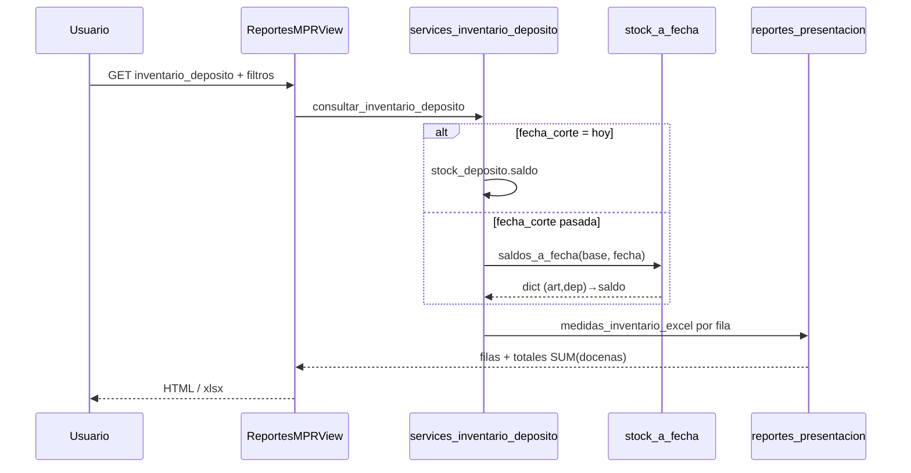

# Design: Inventario por depósito y artículo (MPR)

## Technical Approach

Nuevo reporte hub `demanda/inventario_deposito` con servicio dedicado en grano `(id_deposito, id_articulo)`, medidas **Stock UM nativa** + **Docenas** (reglas A), jerarquía Depósito→Marca→Artículo→Talle, total cabecera **SUM(docenas)**. No extender `reporte_mpr_stock` ni `/stock/inventario/`. Corte=hoy lee `stock_deposito`; histórico (PR-2) reconstruye desde `stock`. Entrega en 2 PRs encadenados (`auto-chain`, presupuesto ~800 líneas).

## Architecture Decisions

| Decisión | Elección | Alternativas | Rationale |
|----------|----------|--------------|-----------|
| Entry point | Slug nuevo `inventario_deposito` en hub MPR | Extender `stock` in-place; pantalla `reports/` | Evita breaking UX del reporte actual (limit 500, sin marca/talle); canon UI hub existente |
| Docenas | `medidas_inventario_excel()` nueva | Reutilizar `_celda_stock_deposito` | `_celda_stock_deposito` fuerza `unidades_por_docena_fijo=12` siempre; incumple packs 12/6/4 en Terminado |
| Divisor pipeline | 12 (pares) | Divisor pack en Semi/Prod | Decisión A + `BEST_SOX_GAP` §2.2 |
| Divisor Terminado/2da | `divisor_docena_pack(cantidad_promedio_bulto)` | Fijo 12 | Paridad BEST PACK 1→12, 2→6, 3→4 |
| Filtro 2da | `tipo_mpr != 2daSeleccion` default | Siempre incluir | Decisión B — paridad «Inventario Resumido TOTAL» |
| Stock a fecha (campo) | **`stock.Fecha`** (spike S3) | `FechaControl` | Motor valorización §5.2 + VB6 Info_Stock; `FechaControl` es contrato inventario físico post-snapshot |
| Stock a fecha (fuente) | Hoy → `stock_deposito`; pasado → `SUM(Entrada-Salida)` en `stock` | Solo kardex corrido | Kardex no sirve para cortes globales; patrón ya documentado en motor costo |
| Export Excel | PR-2 vía `openpyxl` (patrón `inventario_fisico_export`) | Solo CSV hub | Propuesta exige xlsx con Stock+Docenas; hub hoy solo CSV |
| Ubicación `stock_a_fecha` | `stock/services/stock_a_fecha.py` compartido | Solo en servicio MPR | Reutilizable por motor costo valorizado futuro |

## Data Flow

```
GET /mpr/reportes/?grupo=demanda&reporte=inventario_deposito
  → ReportesMPRView.get_context_data
  → parse_filtros_inventario_deposito (depositos, marcas, q, incluir_2da, fecha_corte)
  → consultar_inventario_deposito(base, filtros)
       ├─ corte=hoy: JOIN stock_deposito + deposito + articulo + CE + marca
       └─ corte<pasado: stock_a_fecha(base, fecha) → misma proyección
  → enriquecer_medidas_inventario (medidas_inventario_excel por fila)
  → agrupar_jerarquia_deposito_marca (subtotales marca, total depósito = SUM(docenas))
  → partial inventario_deposito.html
  → format=xlsx (PR-2): exportar_inventario_deposito_xlsx
```



## Medidas Stock vs Docenas (sin `_celda_stock_deposito`)

Nuevo módulo `mpr/inventario_docenas.py`:

```python
def divisor_docena_inventario(tipo_mpr: str, cantidad_promedio_bulto) -> tuple[int, str]:
    if tipo_mpr in ("Produccion", "SemiElaborado"):
        return 12, "pares"
    return divisor_docena_pack(cantidad_promedio_bulto), "packs"

def medidas_inventario_excel(stock, tipo_mpr, cantidad_promedio_bulto) -> dict:
    divisor, um = divisor_docena_inventario(tipo_mpr, cantidad_promedio_bulto)
    stock_n = float(to_decimal_or_none(stock) or 0)
    docenas = round(stock_n / divisor, 2)  # float Excel, no divmod entero
    return {"stock_um": stock_n, "um_etiqueta": um, "docenas": docenas, "divisor": divisor}
```

**Diferencias clave vs `_celda_stock_deposito`:** divisor por `tipo_mpr`; docenas float (no entero doc+resto); total cabecera = `sum(f["docenas"])` en servicio, nunca `sum(stock)/12`.

## stock_a_fecha (PR-2)

```python
# stock/services/stock_a_fecha.py
def saldos_stock_a_fecha(base_empresa, fecha_corte, *, id_depositos=None) -> dict[tuple[int,int], Decimal]:
    """SUM(Entrada)-SUM(Salida) WHERE DATE(Fecha)<=corte AND Anulado<>'Si'."""
```

- Normalizar `fecha_corte` con `to_date_or_none`; comparar `DATE(stock.Fecha)`.
- Índice existente `(CodDeposito, FechaControl)` no cubre `Fecha`; evaluar índice `(CodDeposito, Fecha, IDArt)` en spike si perf lento.
- Spike S3: comparar vs VB6 Info_Stock en `administranet1`; si diverge, documentar delta y ajustar.

## File Changes

| File | Action | Description |
|------|--------|-------------|
| `mpr/inventario_docenas.py` | Create | `divisor_docena_inventario`, `medidas_inventario_excel` |
| `mpr/services_inventario_deposito.py` | Create | Query, filtros, agrupación, totales |
| `stock/services/stock_a_fecha.py` | Create | Reconstrucción histórica (PR-2) |
| `mpr/reportes_hub.py` | Modify | Slug, partial, CSV/Excel columnas |
| `mpr/views.py` | Modify | Rama `inventario_deposito`, params, export xlsx |
| `mpr/reportes_presentacion.py` | Modify | `preparar_inventario_deposito_presentacion` (jerarquía) |
| `mpr/export.py` | Modify | `filas_a_xlsx` o helper dedicado (PR-2) |
| `mpr/templates/mpr/reportes/partials/inventario_deposito.html` | Create | Jerarquía, subtotales, fila TOTAL |
| `mpr/templates/mpr/reportes/_filtros_inventario_deposito.html` | Create | fecha_corte, marcas, depósitos, toggle 2da |
| `mpr/tests/test_inventario_deposito_report.py` | Create | Divisores 12/6/4, totales, 2da OFF, stock_a_fecha |
| `stock/tests/test_stock_a_fecha.py` | Create | Movimientos conocidos (PR-2) |
| `docs/mpr/INVENTARIO_DEPOSITO_ARTICULO.md` | Create | Operativo + paridad Excel |

**No modificar en PR-1:** `reporte_mpr_stock`, `consultar_inventario_tabla`, `_celda_stock_deposito` global.

## Hub: registro, filtros, export

- **Grupo:** `demanda`; label «Inventario por depósito».
- **Filtros GET:** `fecha_corte` (default hoy, UI `dd/MM/yyyy`), `depositos` (multi), `marcas_incluidos` (reutilizar `listar_marcas_catalogo`), `q` (código/descripción), `incluir_2da=0|1`, `presentacion` (docenas|pares).
- **KPI strip:** total docenas scope, depósitos visibles, filas.
- **Agrupación UI:** secciones `<h3>` depósito → tabla por marca → filas artículo; fila subtotal marca; banner total depósito = SUM(docenas).
- **Export PR-2:** `?format=xlsx` — columnas Depósito, Marca, Código, Descripción, Talle, Stock UM, UM, Docenas; hoja resumen por depósito.
- **UI canon:** `mpr/base_mpr.html`, chrome slate-800, Alpine búsqueda (`stock.html`), modales Synap; MUST NOT `alert/confirm/prompt`.

## PR Split (auto-chain, ~800 líneas)

| PR | Scope | Archivos principales | Líneas auth. est. |
|----|-------|---------------------|-------------------|
| **PR-1** | Query hoy + docenas + hub + UI + filtros + tests divisores/totales/2da | inventario_docenas, services_inventario_deposito, hub, view, partial, tests | ~350–450 |
| **PR-2** | stock_a_fecha + fecha_corte UI + export xlsx + tests históricos + docs | stock_a_fecha, export, filtros fecha, docs | ~300–500 |

PR-2 target: rama PR-1. Verificación independiente por slice.

## Testing Strategy

| Layer | Qué | Cómo |
|-------|-----|------|
| Unit | Divisores 12/6/4, docenas float, TOTAL=SUM(docenas) | `mpr/tests/test_inventario_deposito_report.py` — tabla-driven |
| Unit | 2da excluida default | Mock SQL / filtro assert |
| Integration | stock_a_fecha vs movimientos fixture | `stock/tests/test_stock_a_fecha.py` |
| Regression | hub `stock`, `/stock/inventario/` | Tests existentes sin cambios |

Comando: `docker exec Synap_app python manage.py test mpr.tests.test_inventario_deposito_report stock.tests.test_stock_a_fecha`

## Threat Matrix

N/A — sin routing shell, subprocess, VCS automation ni integración de procesos.

## Migration / Rollout

Sin DDL obligatorio. Spike S3 puede recomendar índice `stock(CodDeposito, Fecha, IDArt)` vía catálogo legacy si perf lo exige. Rollback: revert PRs, quitar slug hub.

## Open Questions

- [ ] **S3:** Confirmar `stock.Fecha` vs `FechaControl` en VB6 Info_Stock (bloqueante PR-2 apply).
- [ ] **S1/S2:** Validar UM pack/pares y delta docenas vs Excel muestra (pre-apply PR-1).
- [x] **S4:** Universo artículos — `tipo_art_fab=Tercero` **incluido** (decisión 14/08/2026).
