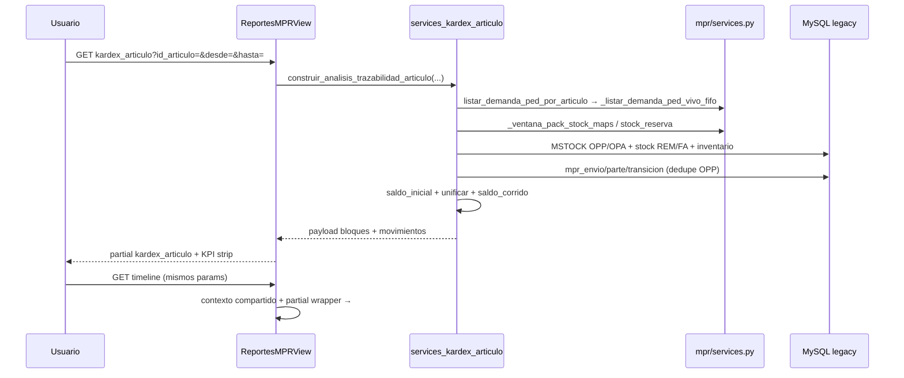

# Design: Trazabilidad artículo — análisis completo

**Change:** `mpr-trazabilidad-analisis-completo`  
**Propuesta:** [proposal.md](./proposal.md) | **Exploración:** [exploration.md](./exploration.md)  
**Plan:** `docs/mpr/PLAN_TRAZABILIDAD_ANALISIS_COMPLETO.md`

---

## Technical Approach

Unificar el hub **Trazabilidad → Kardex artículo** como informe canónico. Un servicio **`construir_analisis_trazabilidad_articulo`** en `mpr/services_kardex_articulo.py` agrega demanda PED, stock/brecha tablero pack, collector REM/FA/INV + eventos MPR y saldo corrido Terminado con saldo real al `desde`. **`construir_kardex_articulo`** queda como wrapper delgado (compat tests). **Timeline** no duplica SQL: partial mínimo + deep-link a `kardex_articulo#timeline` con mismos query params.

---

## Architecture Decisions

| Decisión | Elección | Alternativas | Rationale |
|----------|----------|--------------|-----------|
| Informe canónico | Slug `kardex_articulo` enriquecido | Ampliar `timeline`; tercer reporte | BOM, saldo y búsqueda ya viven en kardex; una fuente de verdad |
| Servicio | `construir_analisis_trazabilidad_articulo` en `services_kardex_articulo.py` | Nuevo `services_trazabilidad_articulo.py` | Módulo ya extraído por tamaño; evita cuarto archivo hasta >1.5k líneas |
| REM/FA/INV | Query directa `stock` (`Comprobante IN ('REM','FA')` + MSTOCK inventario) | Solo MSTOCK | Paridad `_gen_kardex_610_t6.py`; REM/FA no son MSTOCK |
| Saldo corrido | Eje depósitos `suma_stock='Si'`; FA listado, **excluido** del acumulado si `afecta_deposito=False` | Incluir FA en saldo | Decisión producto; columna «Afecta depósito» + tooltip |
| Saldo inicial v1 | Stock real al inicio de `desde`; banner si falla cálculo | `saldo_inicial=0` silencioso | Plan §3.6; no 0 silencioso |
| Demanda PED | `_listar_demanda_ped_vivo_fifo` vía wrapper `listar_demanda_ped_por_articulo` | SQL chat `qty_comercial` | Imputación-aware; paridad tablero |
| Depósito UI | Auto-resolver Terminado MPR (`_ventana_pack_stock_maps`); selector «Todos» = eje Terminado | Forzar un depósito | Alineado tablero pack |
| Timeline | Partial thin wrapper: aviso + enlace GET a kardex + `#timeline`; **sin** 302 permanente | Redirect 302 | Preserva bookmarks timeline; una fuente de datos |
| Export v1 | CSV multi-sección vía `mpr/export.py` | Excel multi-hoja | Excel = stretch post-MVP |
| Entrega | 3 PRs encadenados (~400 líneas c/u) | PR único | Presupuesto revisión alto (800–1200 líneas) |

---

## Data Flow



---

## Servicio — contrato

```python
def construir_analisis_trazabilidad_articulo(
    base_empresa: str,
    id_articulo: int,
    *,
    id_deposito: int | None = None,
    fecha_desde=None,
    fecha_hasta=None,
    limit: int = 500,
) -> dict:
    """Análisis completo: PED, stock, brecha, BOM, movimientos unificados, saldo corrido."""

def construir_kardex_articulo(...) -> dict:
    """Wrapper: delega y proyecta movimientos/kpis (compat backward)."""
```

**Retorno principal** (claves top-level):

| Clave | Contenido |
|-------|-----------|
| `articulo` | id, código, descripción, `es_pack`, `tipo_art_fab` |
| `demanda_ped` | `filas[]`, `totales.p_ped` |
| `stock` | `terminado`, `semi_componentes[]`, `negativo` bool |
| `brechas` | `ped_urgente`, `tot_urgente`, `reserva`, `texto_explicativo` |
| `bom` | existente `get_bom_detalle` + `max_packs` |
| `a_producir` | `cantidad`, `capacidad_semi`, `alerta_semi_cero` |
| `movimientos` | filas unificadas: `clase_ui`, `afecta_deposito`, `entrada`, `salida`, `saldo_corrido`, `subfilas_opa[]` |
| `eventos_mpr` | subconjunto para ancla `#timeline` |
| `kpis` | Pedido, Terminado, PED Urgente, TOT Urgente, saldo_final |
| `saldo_inicial` | int + `calculado_ok` bool |
| `advertencias` | lista español |

**Funciones internas nuevas** (mismo módulo):

- `_consultar_movimientos_stock_rem_fa` — `stock` WHERE `Comprobante IN ('REM','FA')`
- `_consultar_movimientos_inventario_mstock` — motivo faltante/sobrante/inventario + `TipoComp`
- `_consultar_eventos_mpr_articulo` — extraer de `reporte_mpr_trazabilidad_componente` (ledgers)
- `_deduplicar_movimientos` — clave `codigo_movimiento`; preferir MSTOCK sobre `mpr_parte` OPP
- `_calcular_saldo_inicial_terminado` — acumulado previo a `desde` o delta `stock_deposito`
- `_unificar_y_saldo_corrido` — merge cronológico + `_calcular_saldo_corrido_movimientos`
- `_clasificar_movimiento_analisis` — extiende `_clasificar_movimiento_kardex` → `opa|opp|rem|fa|inventario|mpr_*`

**Clasificación inventario/FA** (paridad script):

```python
def _afecta_deposito_terminado(comprobante: str) -> bool:
    return (comprobante or "").upper() != "FA"
```

Motivos inventario: whitelist `motivo_movimiento` (faltante, sobrante, inventario) + `TipoComp` cuando aplique.

---

## Vista y UI

### `ReportesMPRView` (`mpr/views.py`)

| Rama | Cambio |
|------|--------|
| `kardex_articulo` | Llama `construir_analisis_trazabilidad_articulo`; pasa bloques en `meta` + `filas=movimientos` |
| `timeline` | Mismo servicio; `eventos=meta.eventos_mpr`; partial wrapper |

### Bloques UI (canon MPR/reportes)

Orden en `kardex_articulo.html`:

1. **Filtros** — existentes (artículo, depósito, período, docenas\|pares)
2. **Cabecera** — IDArt, código, descripción, badge pack/componente
3. **KPI strip** (`_kpi_strip.html`) — Pedido, Terminado (rojo si &lt;0), PED Urgente, TOT Urgente
4. **DEMANDA PED** — tabla pedidos; include `_bloque_demanda_ped.html`
5. **STOCK + BRECHA** — `_bloque_stock_brecha.html` con texto explicativo negativos
6. **BOM** — existente; links → `kardex_articulo` del componente (no timeline)
7. **MOVIMIENTOS** — tabla con badges `opa/rem/fa/inventario/mpr`; filas expandibles OPA; columna «Afecta depósito»
8. **A PRODUCIR** — `_bloque_a_producir.html`
9. **Ancla `#timeline`** — sub-tabla eventos MPR (reuse estilos `trazabilidad_timeline.html`)

**Timeline partial:** banner «Análisis completo en Kardex artículo» + botón GET preservando params; si `id_articulo` presente, scroll JS a `#timeline` en kardex destino.

---

## File Changes

| Archivo | Acción | Descripción |
|---------|--------|-------------|
| `mpr/services_kardex_articulo.py` | Modify | Servicio análisis + collectors + saldo inicial |
| `mpr/services.py` | Modify | `listar_demanda_ped_por_articulo`; reexport; timeline delega collector |
| `mpr/views.py` | Modify | Payload kardex/timeline unificado |
| `mpr/reportes_hub.py` | Modify | Label «Análisis trazabilidad»; columnas CSV ampliadas |
| `mpr/templates/mpr/reportes/partials/kardex_articulo.html` | Modify | Orquesta bloques + `#timeline` |
| `mpr/templates/mpr/reportes/partials/_bloque_*.html` | Create | demanda, stock_brecha, a_producir (3 partials) |
| `mpr/templates/mpr/reportes/partials/trazabilidad_timeline.html` | Modify | Thin wrapper + deep-link |
| `mpr/templates/mpr/reportes/_kpi_strip.html` | Modify | KPIs brecha pack |
| `mpr/tests/test_analisis_trazabilidad_articulo.py` | Create | Collector, FA sin saldo, saldo inicial, dedupe |
| `mpr/tests/test_kardex_articulo.py` | Modify | Wrapper backward compat |
| `mpr/tests/test_reportes_trazabilidad.py` | Modify | Timeline delegación |
| `docs/mpr/REPORTES_MPR.md` | Modify | Catálogo informe unificado |
| `docs/mpr/TRAZABILIDAD_ARTICULO.md` | Create | Manual operativo + reglas FA/saldo |

---

## PR Split (encadenados)

| PR | Alcance | Verificación |
|----|---------|--------------|
| **PR1 — Servicio** | Collectors REM/FA/INV, unificación, saldo inicial, brecha, dedupe; tests unitarios; sin templates grandes | `test_analisis_trazabilidad_articulo` |
| **PR2 — UI** | Bloques partials, KPI strip, cabecera, movimientos etiquetados, BOM links kardex | Manual pack 610; tests view existentes |
| **PR3 — Export + timeline** | CSV multi-sección `reportes_hub`; timeline wrapper; docs | CSV + deep-link `#timeline` |

Rollback por PR (sin migraciones DB). Presupuesto: ~800–1200 líneas totales; riesgo revisión **Alto**.

---

## Testing Strategy

| Capa | Qué | Cómo |
|------|-----|------|
| Unit | Clasificación REM/FA/INV; FA excluido saldo; saldo inicial; dedupe OPP; fórmulas brecha | Mock cursor MySQL (patrón `test_kardex_articulo.py`) |
| Integration | Vista kardex payload completo; timeline mismo servicio | `test_reportes_trazabilidad.py` |
| Manual | Pack 610 jul–sep/2026: ≥4 OPA, REM/FA etiquetados, paridad tablero | Criterios plan §6 |

```bash
docker exec Synap_app python manage.py test \
  mpr.tests.test_analisis_trazabilidad_articulo \
  mpr.tests.test_kardex_articulo \
  mpr.tests.test_reportes_trazabilidad
```

---

## Threat Matrix

N/A — sin routing nuevo, shell, subprocess, VCS automation ni integración de procesos.

---

## Migration / Rollout

Sin migraciones DB. Feature flag no requerido. Revert por PR restaura `construir_kardex_articulo` y partial timeline autónomo.

---

## Open Questions

- [ ] Ninguna bloqueante — decisiones cerradas en `proposal.md` y `state.yaml`.
